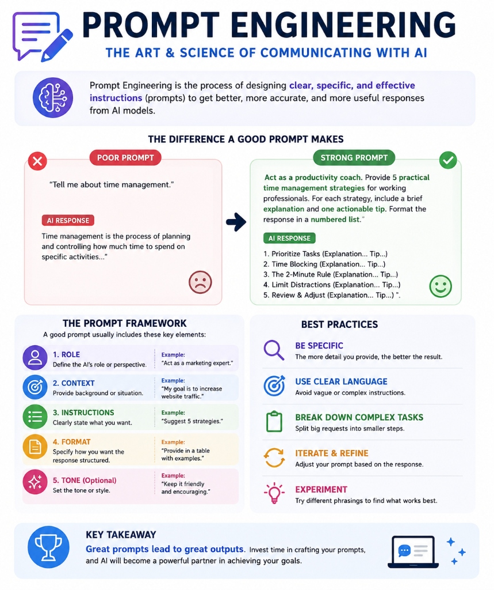
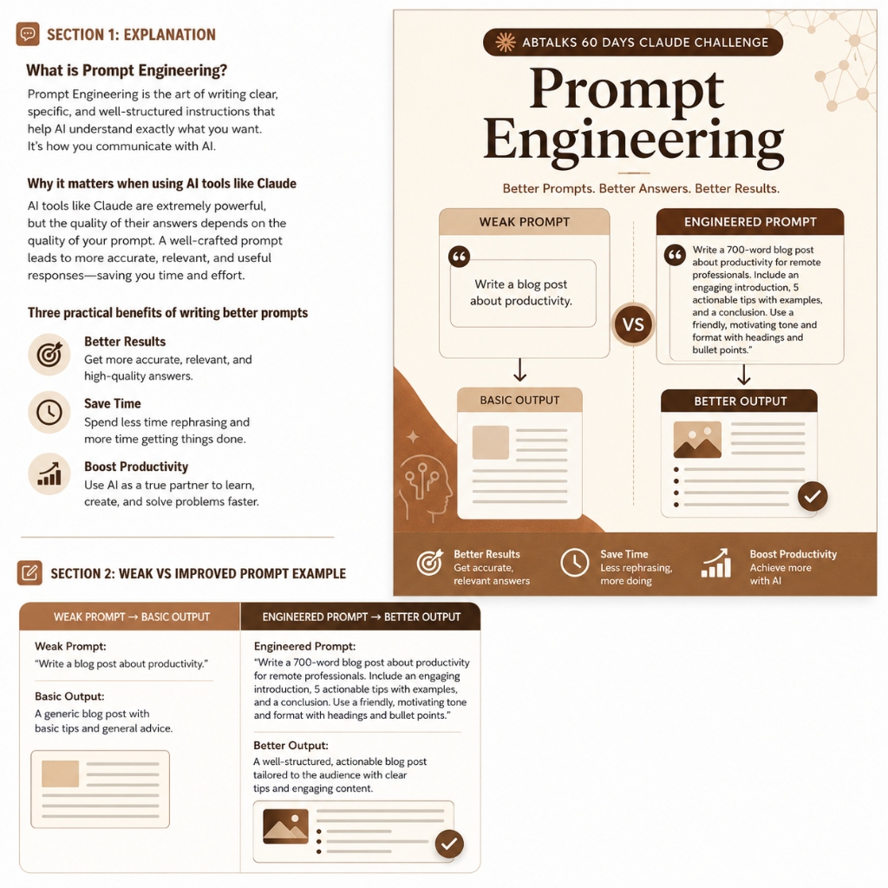

# Day 2: Prompt Engineering — Lazy vs. Engineered Prompts

Hey there! Welcome to Day 2 of my 60-Day AI Challenge. Today, I wanted to learn about **Prompt Engineering**—basically, the art of writing clear instructions to get exactly what you want from an AI like Claude. 

Instead of just reading about it, I decided to run a quick test. I compared a quick, lazy prompt with a detailed, smart prompt to see how different the results would be.

---

## 🛠️ What I Did Today
1. **Tried a Lazy Prompt:** I typed a simple, one-line request to see what Claude would make.
2. **Tried an Engineered Prompt:** I wrote a much more detailed prompt using a proper framework (giving the AI a role, context, clear steps, and a format).
3. **Compared the Results:** I checked both the written output and the visual infographics to see the difference in quality, structure, and design.
4. **Saved the Outputs:** I copied the generated images into my repository so I can track my progress.

---

## 💬 The Prompts I Used

### 1. The Lazy Prompt
> **"Create an image explaining Prompt Engineering"**

* **My thoughts on this:** This is what most people write when they are in a hurry. It's just a single sentence. I didn't tell it who it's for, what topics to cover, or how it should look. It's super basic.

### 2. The Engineered Prompt
> **"Write a 700-word blog post about productivity for remote professionals. Include an engaging introduction, 5 actionable tips with examples, and a conclusion. Use a friendly, motivating tone and format with headings and bullet points."**
> 
> *Also tested this time-management version:*
> **"Act as a productivity coach. Provide 5 practical time management strategies for working professionals. For each strategy, include a brief explanation and one actionable tip. Format the response in a numbered list."**

* **My thoughts on this:** This prompt is way better. It gives Claude a clear **Role** (acting as a coach/writer), **Context** (remote/working professionals), clear **Instructions** (5 tips with examples), a clear **Format** (headings, numbered list), and a specific **Tone** (friendly and motivating).

---

## 🔍 How the Outputs Compared

| What I Checked | Lazy Prompt Output (Image 1) | Engineered Prompt Output (Image 2) |
| :--- | :--- | :--- |
| **Explanation Quality** | Very basic. It just gives high-level definitions that you could find anywhere on the web. | Much more practical and useful, with tips tailored specifically for real-world professionals. |
| **Structure & Flow** | Pretty generic. It just lists general rules and simple do's and don'ts. | Super clean. It uses bold headings and clear bullet points that make it very easy to read and scan. |
| **Examples Used** | Simple and generic (like "Tell me about time management"). | Real-world, practical examples that make sense for a remote work blog. |
| **Design & Aesthetic** | Bright and colorful, but looks a bit like a standard, generic business slide. | Absolutely amazing! It has a very modern, editorial brown and cream theme, clean typography, and even includes the "ABTALKS 60 Days Claude Challenge" branding. |

---

## 🖼️ The Visual Outputs

### 1. Infographic from the Lazy Prompt
This is the first image. It's colorful and has some good general tips, but the design is a bit basic and feels like a standard template:

### 2. Infographic from the Engineered Prompt
This is the second image. Because the prompt was so specific, the output looks incredibly professional, stylish, and customized for the challenge:

---

## 🧠 My Key Learnings & Takeaways

* **If you ask a lazy question, you get a lazy answer:** Spending an extra 30 seconds to write a detailed prompt saves you minutes of correcting the AI later. 
* **The 5-Step Prompt Secret:** I learned that a great prompt usually has these five parts:
  1. **Role:** Who should the AI pretend to be? (e.g., a B.Tech tutor, a productivity coach).
  2. **Context:** What is the background or who is the audience? (e.g., remote workers).
  3. **Instructions:** What exactly do you need? (e.g., 5 tips, 700 words).
  4. **Format:** How should it look? (e.g., a table, bullet points, headers).
  5. **Tone:** How should it sound? (e.g., friendly, casual, encouraging).
* **Better Prompts = Better Visuals:** Clear instructions don't just help with writing text; they also tell the AI how to structure visual graphics, colors, and layout in a much cleaner way.
