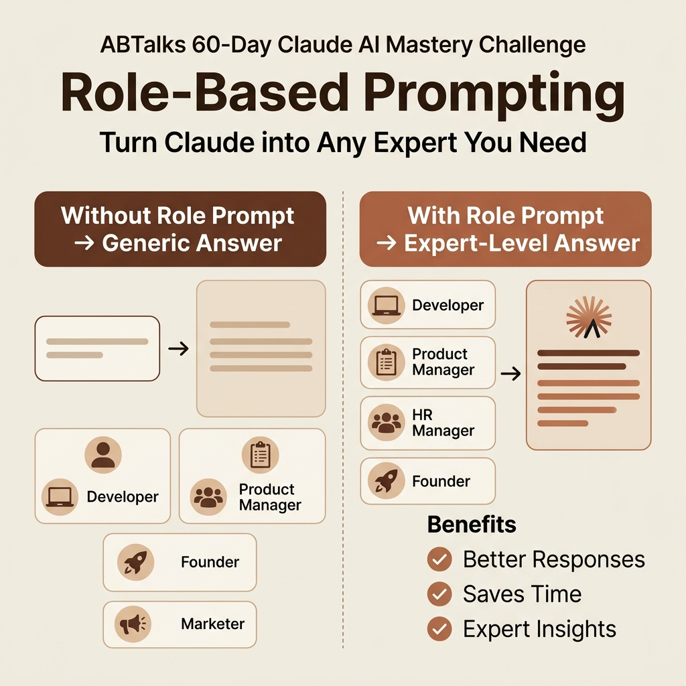
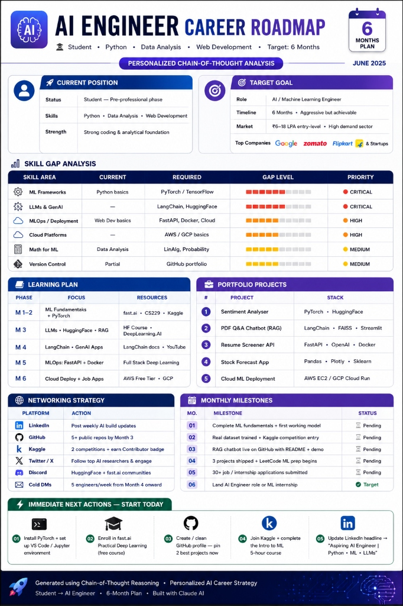
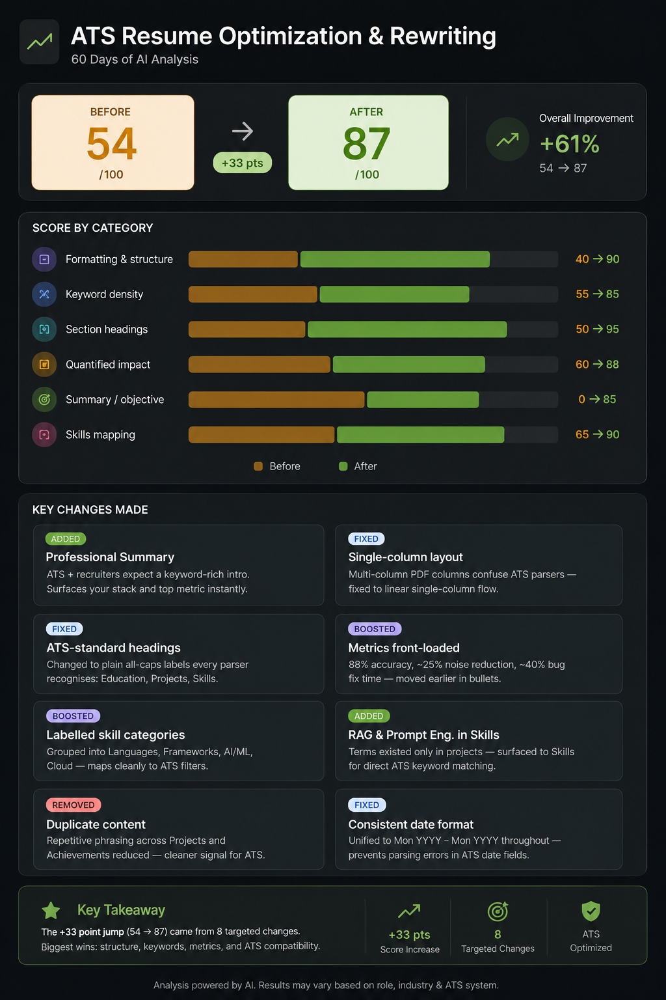
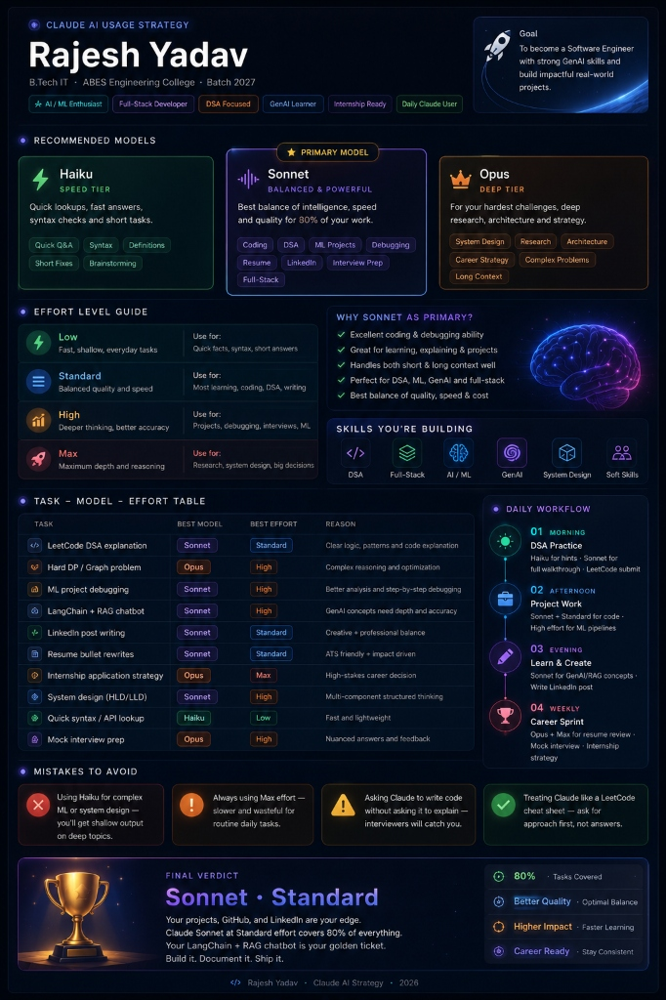
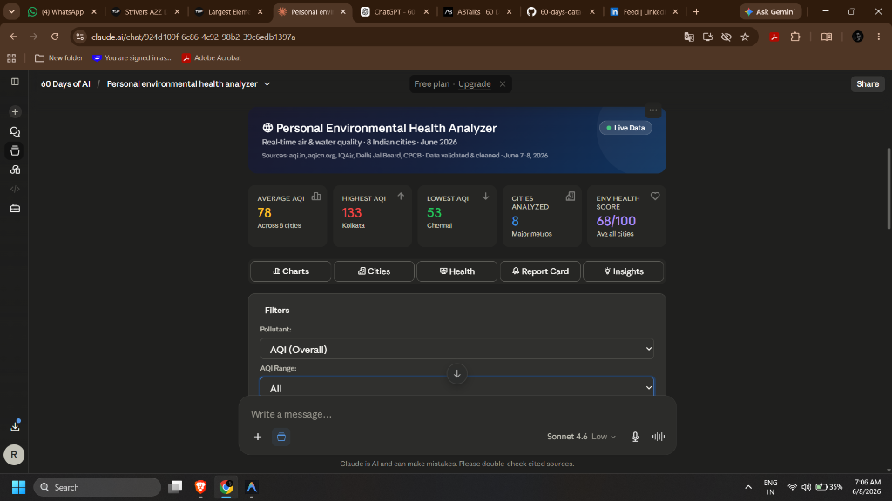
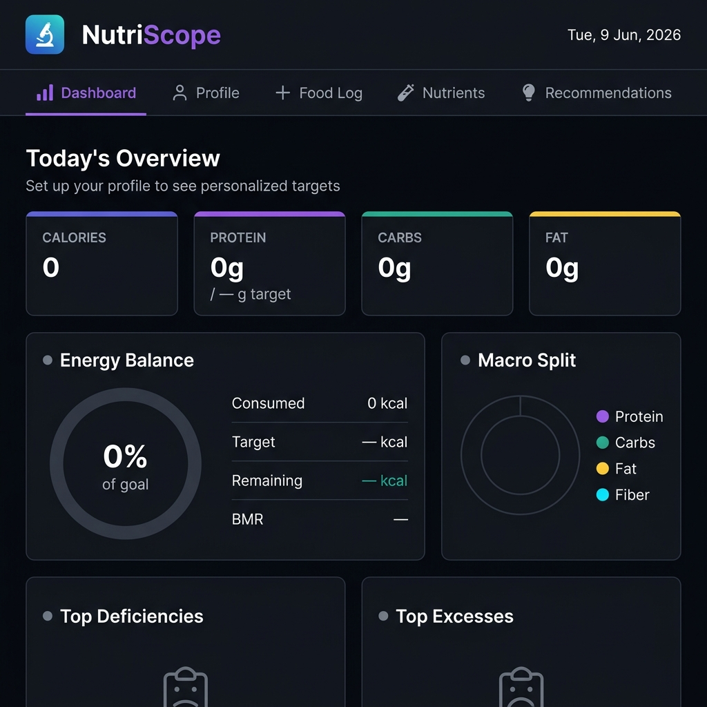
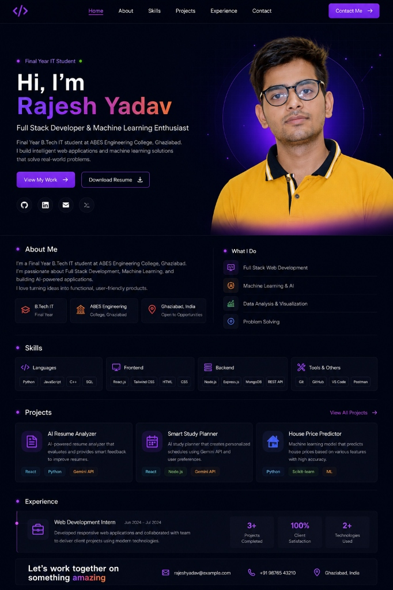

# 60 Days of AI Challenge

## About Me

Hi, I'm Rajesh Yadav, a B.Tech Computer Science student.

## My Goals

* Learn AI tools effectively
* Improve prompt engineering skills
* Build AI-powered projects
* Strengthen software engineering knowledge
* Maintain consistency for 60 days

## Day 1

* Installed Claude Desktop
* Created AI Personality Profile
* Started my 60 Days of AI journey

### Day 1 Profile and Portrait

## Day 02

* Explored Prompt Engineering concepts
* Compared Lazy vs. Engineered Prompts
* Analyzed output quality and structure
* Documented visual comparison infographics

### Day 02 Comparison and Outputs
Detailed documentation and prompt engineering comparisons are located in the [Day 02 Folder](day02/day02.md).

#### Lazy Prompt Infographic:

#### Engineered Prompt Infographic:

## Day 03

* Explored Role-Based Prompting concepts
* Tested prompts without roles, with Founder persona, and with Developer persona
* Installed the Claude Usage Counter extension
* Analyzed outputs, comparing business focus vs. technical implementation depth
* Documented comparisons, benefits, and key learnings

### Day 03 Comparison and Outputs
Detailed documentation and comparisons are located in the [Day 03 Folder](day03/day03.md).

#### LinkedIn Infographic:

## Day 04

* Explored Chain-of-Thought (CoT) Prompting concepts
* Answered diagnostic questions to guide Claude's reasoning
* Generated a personalized 6-month AI Engineer Career Roadmap
* Analyzed skills gap and identified key action items
* Documented roadmap, insights, and next actions

### Day 04 Roadmap and Outputs
Detailed documentation and the career roadmap are located in the [Day 04 Folder](day04/day4.md).

#### AI Engineer Career Roadmap:

## Day 05

* Explored Context Engineering vs Prompt Engineering
* Ran Prompt A (no context) to generate a generic 30-day ML roadmap
* Ran Prompt B (with personal context) to generate a personalized SWE + ML/DS roadmap
* Compared both outputs side-by-side and analyzed the role of context
* Documented key learnings: context transforms AI from a textbook into a personal coach

### Day 05 Comparison and Outputs
Detailed documentation and prompt comparisons are located in the [Day 05 Folder](day05/day5.md).

## Day 06

* Explored ATS Resume Optimization & Rewriting
* Analyzed my original resume and converted it to an ATS-friendly single-column layout
* Added a professional summary and categorized skills to match search filters
* Front-loaded metrics and removed duplicate content to reduce parsing noise
* Improved my ATS score from 54/100 to 87/100 (+33 points, +61% overall improvement)
* Saved both the original and optimized versions of the resume

### Day 06 Outputs and Documentation
Detailed documentation, key learnings, and score comparison infographics are located in the [Day 06 Folder](day06/day6.md).

#### ATS Score Transformation:

## Day 07

* Formulated a comprehensive Claude AI Usage Strategy
* Defined model mappings for Haiku (speed tier), Sonnet (balanced/primary), and Opus (deep reasoning tier)
* Established an Effort Level Guide (Low, Standard, High, Max) based on task complexity
* Mapped various professional tasks to their optimal model and effort levels
* Designed a daily and weekly workflow for DSA practice, projects, and learning

### Day 07 Outputs and Documentation
Detailed documentation and strategy dashboards are located in the [Day 07 Folder](day07/day7.md).

#### Claude AI Usage Strategy:

## Day 08

* Built a personal web-based **Environmental Health Analyzer** dashboard for 8 Indian cities
* Analyzed live environmental metrics including AQI, PM2.5, PM10, TDS, hardness, and pH
* Created dynamic charts comparing pollutants, overall AQI, and category distributions using Chart.js
* Developed risk calculations detailing the direct impact of air and water pollution on health, skin, and hair
* Formulated an automated report card grading system based on combined environmental factors
* Designed a "Cinematic Edition" retro-futuristic dark mode dashboard overlay summarizing all data

### Day 08 Outputs and Documentation
Detailed documentation, interactive dashboard, and key analytical findings are located in the [Day 08 Folder](day08/day8.md).

#### Environmental Health Analyzer Dashboard:

## Day 09

* Built **NutriScope** — a Precision Nutrition Tracker — in two iterations (MVP & Enhanced)
* Designed a single-file HTML dashboard with dark mode using Inter and Space Grotesk typography
* Integrated Chart.js to visualize daily macro splits (Calories, Protein, Carbs, Fat)
* Implemented body composition calculators for BMI, BMR, and TDEE
* Created a running food log database with localStorage persistence and slide-up toast notifications

### Day 09 Outputs and Documentation
Detailed documentation and comparisons are located in the [Day 09 Folder](day09/day9.md).

#### NutriScope Dashboard:

## Day 10

* Integrated and optimized personal **Developer Portfolio** page into the challenge repository
* Removed LeetCode profile links from the social icons and direct links sections to curate active profiles
* Staged the clean and responsive HTML portfolio layout for production deployment

### Day 10 Documentation
Detailed documentation is located in the [Day 10 Folder](day10/day10.md).

#### Portfolio Interface:

## Connect With Me

* **GitHub Profile:** https://github.com/Rajeshydv07
* **Challenge Repository:** https://github.com/Rajeshydv07/60-day-claude-challenge-

