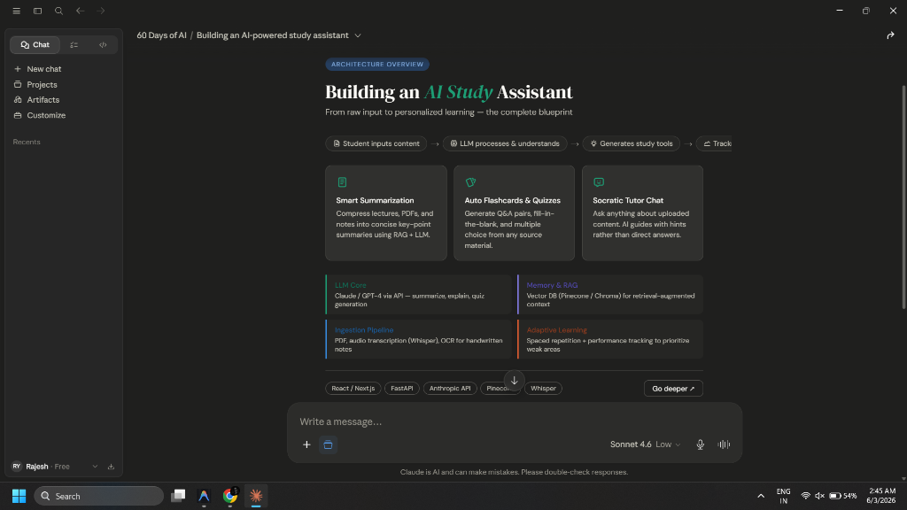
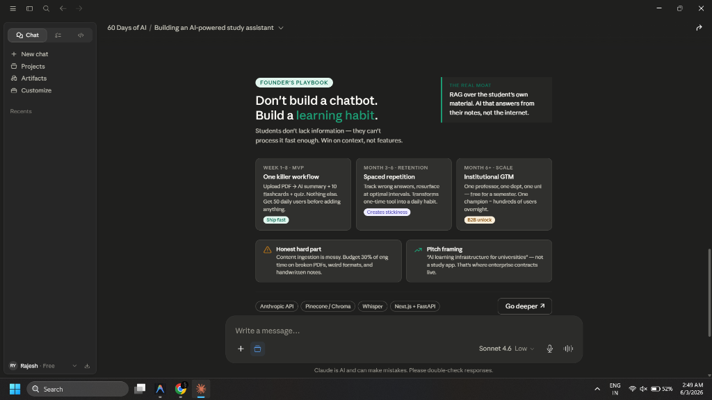
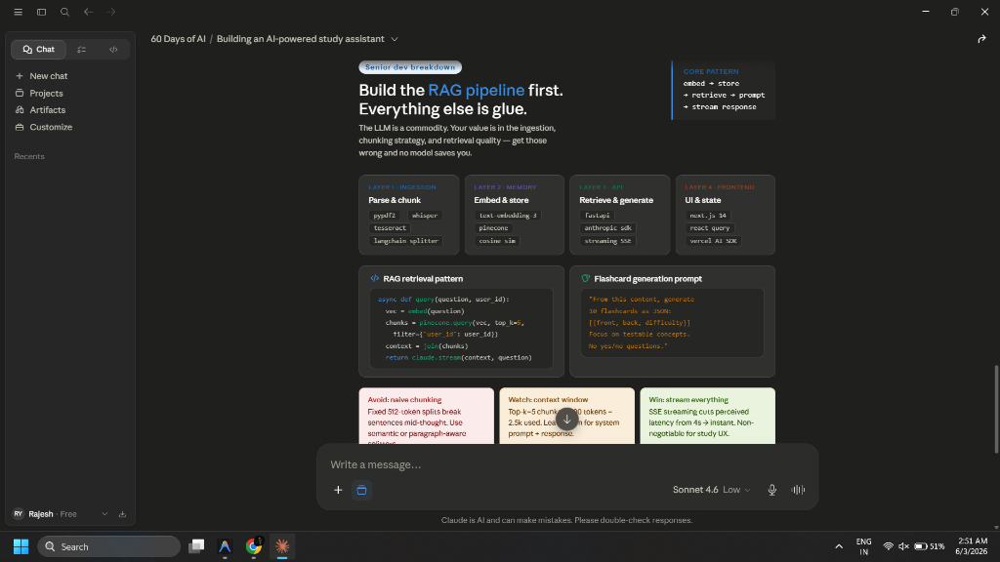
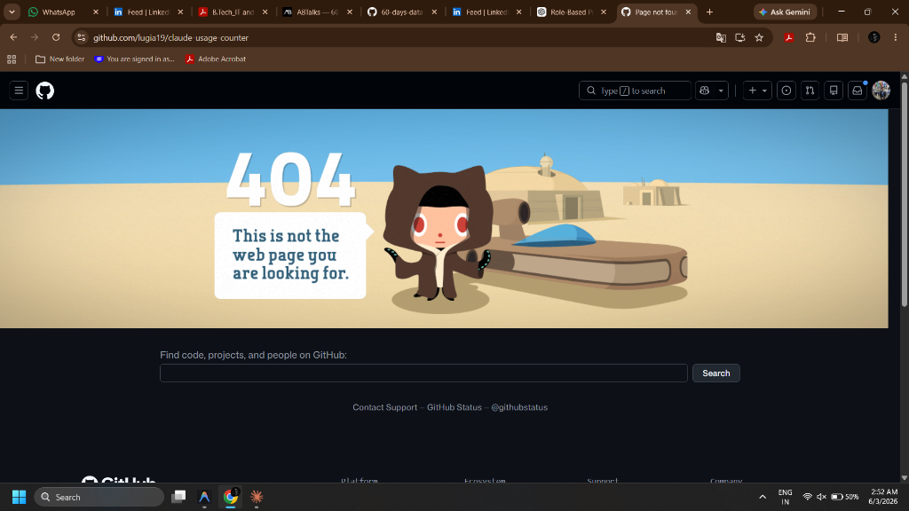

# Day 3 - Role-Based Prompting

## What is Role-Based Prompting?

Role-Based Prompting means assigning Claude a role before asking a question.

Examples:
* Founder
* Developer
* Product Manager
* HR Manager

This gives more focused and expert-level responses.

---

## Why It Matters

The role provides context and expertise.

This helps Claude generate:
* More relevant answers
* Better insights
* Actionable recommendations

---

## Prompt Without Role

`How can I build an AI-powered study assistant for students?`

### Output Summary

Claude provided general guidance about creating an AI-powered study assistant, outlining typical steps like defining features, gathering datasets, and setting up core models.

---

## Founder Persona Prompt

`Act as a startup founder.`
`How can I build an AI-powered study assistant for students?`

### Output Summary

Focused on:
* Business model
* Market validation
* Revenue generation
* Customer acquisition

---

## Developer Persona Prompt

`Act as a senior software developer.`
`How can I build an AI-powered study assistant for students?`

### Output Summary

Focused on:
* Technology stack
* APIs
* Databases
* Architecture
* Deployment

---

## Comparison

| Persona | Focus |
| :--- | :--- |
| **No Role** | General advice and generic outline |
| **Founder** | Business strategy, market validation, MVP, and user growth |
| **Developer** | Technical implementation, software design, tech stack, APIs, and scaling |

---

## Three Benefits of Role-Based Prompting

1. **Better response quality:** Tailored responses that avoid generic answers.
2. **Faster expert-level insights:** Skips basic introductions and jumps straight into industry-specific depth.
3. **More relevant recommendations:** Employs appropriate terminology and methodologies suitable for the specified persona.

---

## Screenshots

### 1. Prompt Without Role

### 2. Founder Persona Prompt

### 3. Developer Persona Prompt

### 4. Claude Usage Counter Extension

---

## Key Learnings

Role-Based Prompting significantly improves AI output quality by giving Claude a specific perspective and expertise. It guides the model to filter out irrelevant contexts and address the query using specialized frameworks and professional vocabularies.

---

## LinkedIn Image Concept

### Title
Role-Based Prompting

### Subheading
ABTalks 60-Day Claude AI Mastery Challenge

### Subtitle
Turn Claude into Any Expert You Need

### Theme
Claude-inspired Brown, Beige and Cream

### Visual Comparison
Without Role Prompt  
↓  
Generic Answer  

**VS**  

With Role Prompt  
↓  
Expert-Level Answer  

### Persona Cards
* 💻 Developer
* 📋 Product Manager
* 👥 HR Manager
* 🚀 Founder
* 📢 Marketer

### Benefits
* ✓ Better Responses
* ✓ Saves Time
* ✓ Expert Insights

### LinkedIn Post Graphic

