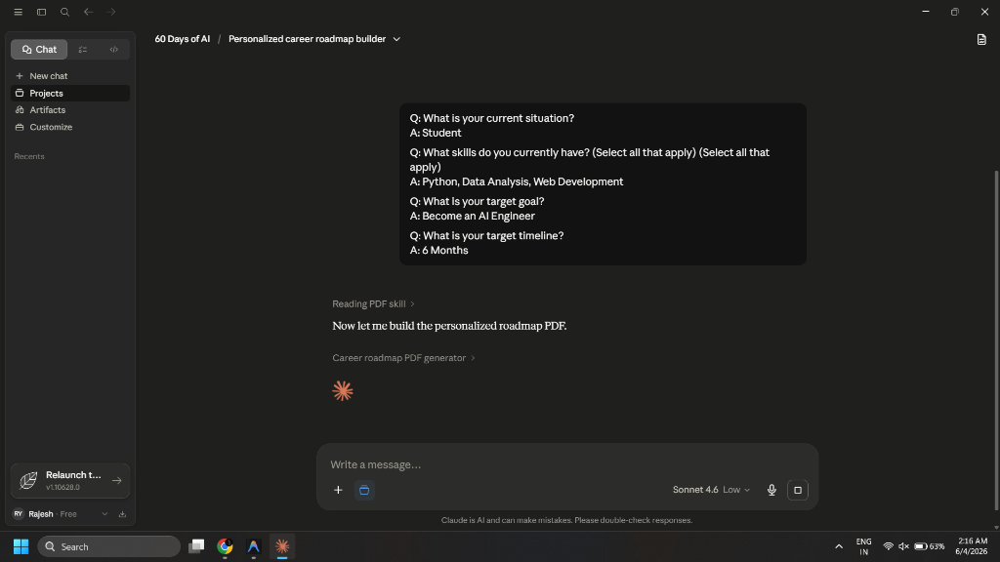
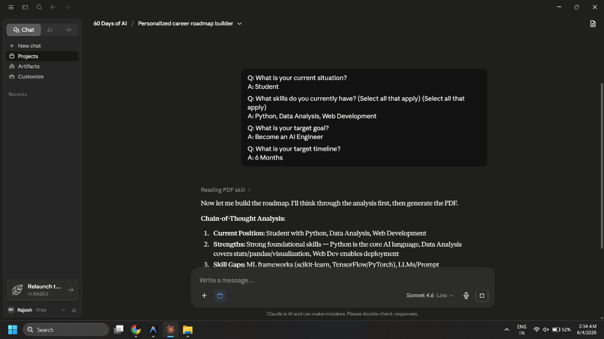

# Day 4: Chain-of-Thought Prompting & Career Roadmap

Hey everyone! Welcome to Day 4 of my 60-Day AI Challenge. Today, I explored **Chain-of-Thought (CoT) Prompting** and used it to generate a personalized career roadmap to become an AI Engineer in 6 months.

## What is Chain-of-Thought Prompting?
Chain-of-Thought (CoT) Prompting is a technique where we prompt Claude to think step-by-step before giving a final answer. Instead of jumping straight to the conclusion, Claude breaks down its reasoning. This is super useful for complex planning, logic, and decision-making tasks because it prevents the AI from making rushed assumptions.

In today's challenge, I used a CoT prompt template that starts by asking 4 diagnostic questions to understand my background before building the roadmap.

---

## The 4 Diagnostic Questions & My Answers
Claude asked me the following questions to personalize the analysis, and here is how I responded:

1. **Q: What is your current situation?**
   * **A:** Student (I'm a B.Tech Computer Science student!)
2. **Q: What skills do you currently have? (Select all that apply)**
   * **A:** Python, Data Analysis, Web Development
3. **Q: What is your target goal?**
   * **A:** Become an AI Engineer
4. **Q: What is your target timeline?**
   * **A:** 6 Months

---

## My Personalized Career Roadmap
After analyzing my responses, Claude generated a beautiful and highly detailed **AI Engineer Career Roadmap**. 

Here is the screenshot of the conversation and the final generated roadmap:

### 1. Claude Chat & Diagnostic Questions

### 2. Claude's Chain-of-Thought Thinking Process

### 3. The AI Engineer Career Roadmap PDF

---

## Skill Gap Analysis (My Biggest Insight)
Looking at the roadmap's **Skill Gap Analysis**, my current and required skills were compared:

* **ML Frameworks:** PyTorch / TensorFlow (Critical Gap - 7/10)
* **LLMs & GenAI:** LangChain, HuggingFace (Critical Gap - 7/10)
* **MLOps / Deployment:** FastAPI, Docker, Cloud (High Gap - 5/10)
* **Cloud Platforms:** AWS / GCP basics (High Gap - 5/10)
* **Math for ML:** LinAlg, Probability (Medium Gap - 4/10)
* **Version Control:** GitHub portfolio (Medium Gap - 4/10)

### 💡 My Biggest Insight:
My biggest realization was that **having basic Python and Web Development skills is a good starting point, but it's not enough to build production-grade AI apps.** I have a massive critical gap (7/10) in ML Frameworks (like PyTorch) and LLMs & GenAI (like LangChain and HuggingFace). 

I used to think that because I knew Python and Web Dev, I could easily transition. But this roadmap showed me I need to roll up my sleeves and learn **PyTorch** and **RAG (Retrieval-Augmented Generation)** systematically. Seeing the learning plan broken down month-by-month makes it feel achievable instead of overwhelming.

---

## Monthly Milestones & Learning Plan
The roadmap lays out a clear month-by-month plan:
* **Month 1-2 (ML Fundamentals + PyTorch):** fast.ai, CS229, Kaggle.
* **Month 3 (LLMs + HuggingFace + RAG):** HF Course, DeepLearning.AI.
* **Month 4 (LangChain + GenAI Apps):** Build and ship apps using LangChain.
* **Month 5 (MLOps: FastAPI + Docker):** Packaging models into APIs.
* **Month 6 (Cloud Deploy + Job Apps):** AWS/GCP deployment and active job hunting.

---

## Immediate Next Actions (Starting Today!)
To kick off this roadmap, I'm starting with these 5 actions:
1. **Set up environment:** Install PyTorch and set up my VS Code/Jupyter environment.
2. **Enroll in Course:** Sign up for the free `fast.ai` *Practical Deep Learning for Coders* course.
3. **Clean GitHub:** Organize my GitHub profile and pin my best two web development projects.
4. **Join Kaggle:** Set up my profile and complete the 5-hour *Intro to ML* course.
5. **Update LinkedIn:** Optimize my headline to reflect my new focus: *"Aspiring AI Engineer | Python - ML - LLMs"*.

This challenge is getting exciting! Time to get to work on Month 1. Let's go! 🚀
