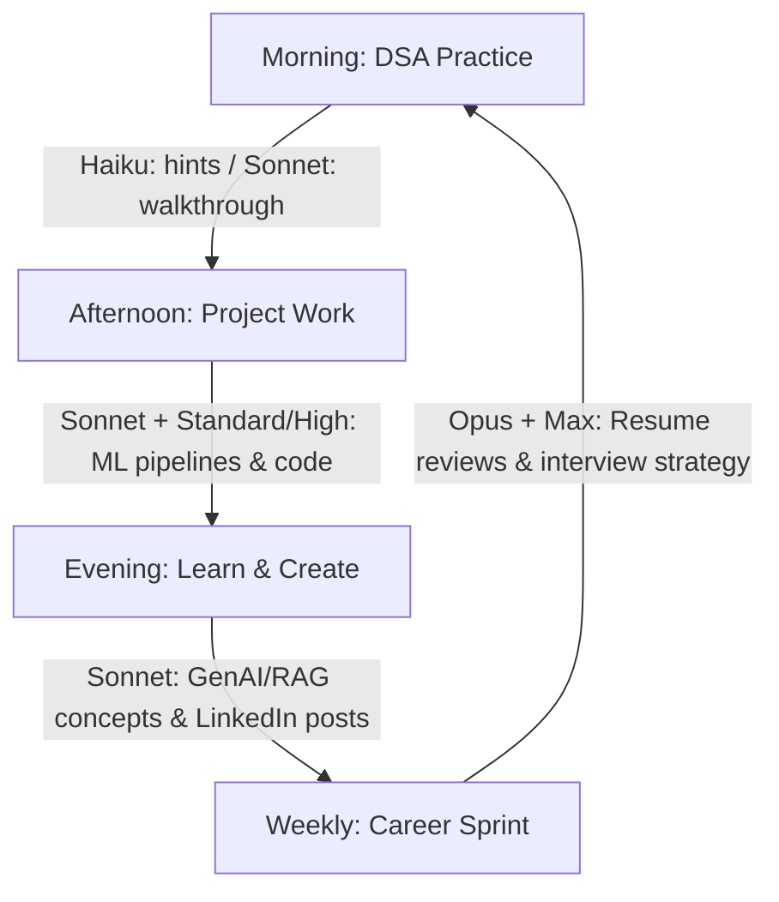

# Day 7 - Claude AI Usage Strategy

This is Day 7 of my 60-Day AI Challenge. Today I formulated and documented my personalized Claude AI Usage Strategy to optimize my learning path and project development.

## Strategic Overview

To achieve my goal of becoming a Software Engineer with strong GenAI skills and building impactful real-world projects, I need to use the right Claude models with the right effort levels for different tasks. This strategy ensures I maximize my productivity, learning depth, and resource usage.

---

## My Goal
> **To become a Software Engineer with strong GenAI skills and build impactful real-world projects.**

---

## Claude Model Framework

I map different tasks to the three core Claude models:

### 1. Haiku (Speed Tier)
* **When to use:** Quick Q&A, syntax lookups, definitions, short fixes, and quick brainstorming.
* **Why:** Fast and lightweight, perfect for low-complexity queries that don't need deep reasoning.

### 2. Sonnet (Balanced & Powerful) — *Primary Model*
* **When to use:** Coding, DSA, ML projects, debugging, resume writing, LinkedIn content creation, interview prep, and full-stack development.
* **Why:** Excellent coding/debugging ability, great at explanations, handles long contexts, and offers the best balance of quality, speed, and cost.

### 3. Opus (Deep Tier)
* **When to use:** System design, deep research, complex architectural decisions, high-stakes career strategy, and extremely complex problems.
* **Why:** Deepest reasoning capabilities, best for multi-step structured thinking and complex decision-making.

---

## Effort Level Guide

Choosing the right effort level ensures high-quality results without unnecessary latency:

*   **Low:** Fast, shallow, everyday tasks (e.g., quick facts, syntax, short answers).
*   **Standard:** Balanced quality and speed (e.g., most learning, coding, DSA, and writing).
*   **High:** Deeper thinking and better accuracy (e.g., projects, debugging, interview prep, and ML).
*   **Max:** Maximum depth and reasoning (e.g., research, system design, major decisions).

---

## Task - Model - Effort Mapping

| Task | Best Model | Best Effort | Reason |
| :--- | :--- | :--- | :--- |
| **LeetCode DSA explanation** | Sonnet | Standard | Clear logic, patterns, and code explanation |
| **Hard DP / Graph problem** | Opus | High | Complex reasoning and optimization |
| **ML project debugging** | Sonnet | High | Better analysis and step-by-step debugging |
| **LangChain + RAG chatbot** | Sonnet | High | GenAI concepts need depth and accuracy |
| **LinkedIn post writing** | Sonnet | Standard | Creative + professional balance |
| **Resume bullet rewrites** | Sonnet | Standard | ATS-friendly + impact-driven |
| **Internship application strategy** | Opus | Max | High-stakes career decision |
| **System design (HLD/LLD)** | Sonnet | High | Multi-component structured thinking |
| **Quick syntax / API lookup** | Haiku | Low | Fast and lightweight |
| **Mock interview prep** | Opus | High | Nuanced answers and feedback |

---

## Daily Workflow

### 1. Morning: DSA Practice
*   **Method:** Use Haiku for hints to keep from spoiling the solution, and use Sonnet for a full walkthrough if stuck. Submit on LeetCode.

### 2. Afternoon: Project Work
*   **Method:** Use Sonnet + Standard effort for general coding. Shift to High effort when working on complex ML pipelines.

### 3. Evening: Learn & Create
*   **Method:** Use Sonnet to understand GenAI/RAG concepts, and then write LinkedIn posts summarizing the day's progress.

### 4. Weekly: Career Sprint
*   **Method:** Use Opus + Max effort for detailed resume reviews, mock interviews, and structuring my internship application strategy.

---

## Mistakes to Avoid

*   ⚠️ **Using Haiku for complex ML or system design:** You will get shallow outputs on deep, nuanced topics.
*   ⚠️ **Always using Max effort:** Slower and wasteful for routine daily tasks.
*   ⚠️ **Asking Claude to write code without explanation:** Interviewers will catch you; focus on learning the reasoning.
*   ⚠️ **Treating Claude like a LeetCode cheat sheet:** Always ask for the approach and pattern first, not just the answers.

---

## Final Verdict

> **Sonnet • Standard**
>
> My projects, GitHub, and LinkedIn are my edge. Claude Sonnet at Standard effort covers 80% of everything. My LangChain + RAG chatbot is my golden ticket. Build it. Document it. Ship it.
>
> **Metrics:**
> *   🎯 80% Tasks Covered
> *   📈 Better Quality
> *   🚀 Higher Impact
> *   💼 Career Ready

---

## Strategy Dashboard

Below is the visual dashboard showing my Claude AI Usage Strategy:

