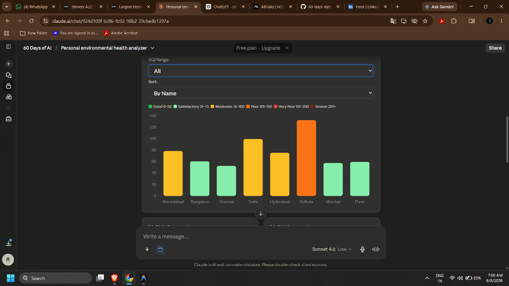
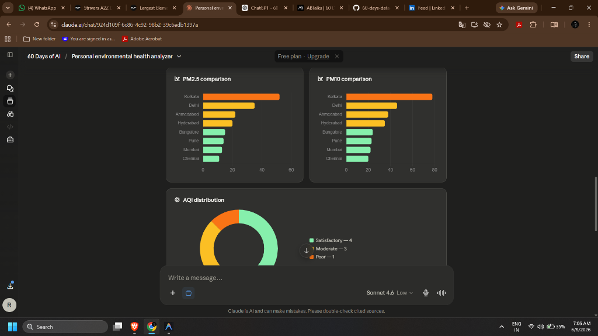
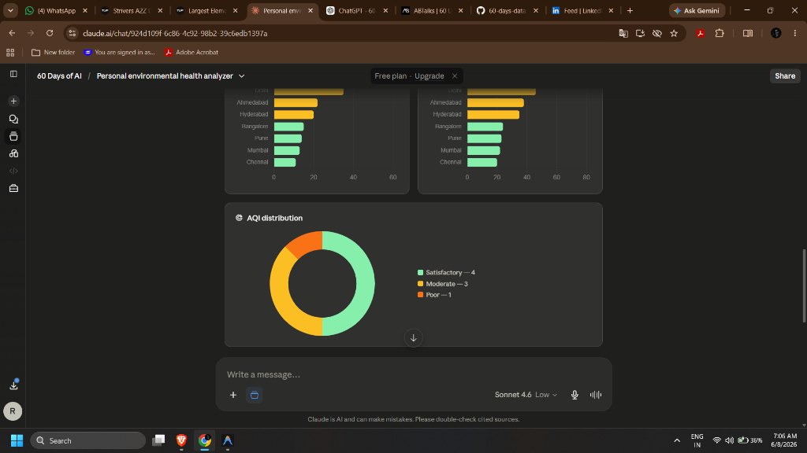
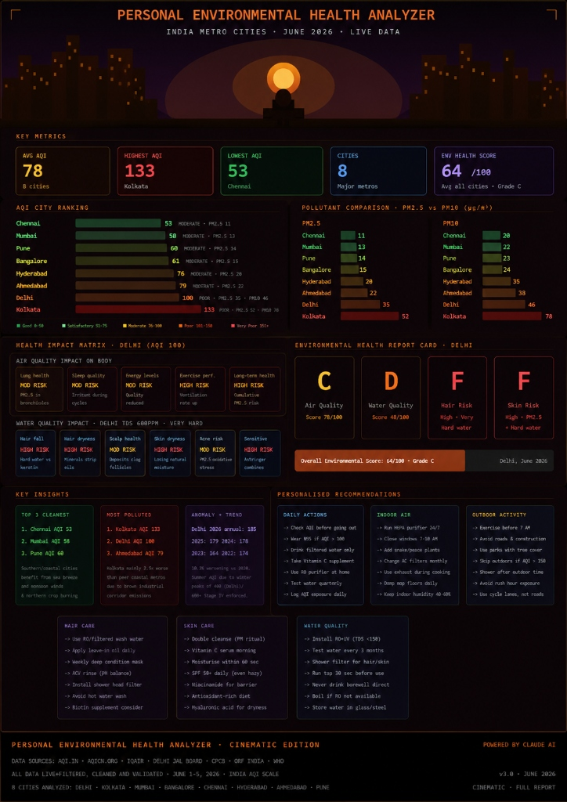

# Day 8 - Personal Environmental Health Analyzer

This is Day 8 of my 60-Day AI Challenge. Today I built a personal web-based dashboard called the **Personal Environmental Health Analyzer** to track and analyze live air quality and water quality data across 8 major Indian cities. 

I wanted to make a tool that doesn't just show boring tables of numbers, but actually tells me how the air and water in each city directly impacts my daily life, skin, hair, and overall health.

---

## Why I Built This
Living in India, we talk a lot about pollution, but it is hard to connect raw values like "PM2.5 of 35 µg/m³" or "TDS of 600 ppm" to actual day-to-day health. I wanted to build a simple tool that:
1. Gathers key metrics (AQI, PM2.5, PM10, Water Quality, TDS, Hardness, and pH).
2. Calculates an easy-to-understand **Environmental Health Score (0-100)** and assigns a letter grade (A to F).
3. Breaks down specific health risks (lung health, sleep quality, hair fall, skin dryness, scalp flaking, acne).
4. Gives personalized daily recommendations for skin care, hair care, water purification, and outdoor activities.

---

## The Core Data & Scoring System

I set up data for 8 major metros based on early June 2026 reports (from sources like aqi.in, aqicn.org, IQAir, Delhi Jal Board, and CPCB):

*   **Delhi:** AQI 100 (Moderate) · TDS 600 ppm (Very Hard) · Water Quality Score 48
*   **Kolkata:** AQI 133 (Poor) · TDS 450 ppm (Hard) · Water Quality Score 55
*   **Ahmedabad:** AQI 79 (Moderate) · TDS 520 ppm (Hard) · Water Quality Score 45
*   **Hyderabad:** AQI 76 (Moderate) · TDS 280 ppm (Moderate) · Water Quality Score 62
*   **Bangalore:** AQI 61 (Moderate) · TDS 220 ppm (Soft) · Water Quality Score 68
*   **Mumbai:** AQI 58 (Moderate) · TDS 200 ppm (Soft) · Water Quality Score 72
*   **Chennai:** AQI 53 (Moderate) · TDS 300 ppm (Moderate) · Water Quality Score 66
*   **Pune:** AQI 60 (Moderate) · TDS 230 ppm (Soft) · Water Quality Score 70

### Scoring Formulas
To calculate the overall grade, I wrote a few Javascript helper functions:
*   **Air Quality Score:** Starts at 100 and drops based on AQI: `Math.max(0, Math.round(100 - (aqi / 3)))`
*   **Water Quality Score:** Uses the baseline Water Quality Index (wq) directly.
*   **Overall Score:** A weighted average of Air (55%) and Water (45%): `Math.round((AirScore * 0.55) + (WaterScore * 0.45))`
*   **Grading Scale:** 
    *   **A** (>= 85) · Cleanest environment
    *   **B** (70–84) · Safe and comfortable
    *   **C** (55–69) · Minor irritation / precautions needed
    *   **D** (40–54) · Poor quality / high risks
    *   **F** (< 40) · Hazardous

---

## App Features & Code Walkthrough

The app is built entirely in HTML and Vanilla CSS with a clean glassmorphic dark interface. I used **Chart.js** to handle the data visualizations.

Here are the main pages and filters I built:

### 1. Dashboard Home
The header features a flashing green live badge. Right below it, I created a metrics grid showing the running stats: average AQI (78), highest AQI (133 - Kolkata), lowest AQI (53 - Chennai), number of cities analyzed (8), and the average environmental score across all cities (68/100, which translates to a Grade C).

### 2. Filters & Sorts
Under the Charts tab, users can select the pollutant type (AQI, PM2.5, or PM10), filter the cities by category (e.g. only show "Moderate" or "Poor" cities), and sort them alphabetically, by lowest value, or by highest value. The colors of the bars update automatically based on the AQI ranges (green for Good, orange/yellow for Moderate, red for Poor).

### 3. Comparison & Distribution Charts
I created two horizontal bar charts to side-by-side compare the finer particulates (PM2.5 and PM10) across all cities. At the bottom, a doughnut chart shows the distribution of city categories (4 Satisfactory, 3 Moderate, 1 Poor).

### 4. Cinematic Edition (Overall View)
To finish it up, I designed a custom "Cinematic Edition" graphic featuring a sunset city skyline silhouette with a meditating figure, representing the background aesthetic of the dashboard's environment health score visualization.

---

## My Personal Observations & Key Learnings

*   **Coastal Breeze Help:** Mumbai (58 AQI) and Chennai (53 AQI) have much cleaner air than inland cities, likely due to coastal wind patterns clearing out smoke.
*   **The Kolkata Anomaly:** Kolkata was the worst city today (AQI 133, Poor), performing worse than Delhi. This was surprising for a coastal city, and is likely driven by the heavy industrial clusters nearby.
*   **Hard Water Struggles:** Even though Bangalore and Delhi have relatively similar AQI values during summer, Delhi's water hardness is "Very Hard" (600 ppm TDS) while Bangalore's is "Soft" (220 ppm TDS). This makes Delhi a much higher risk area for hair fall and skin dryness.
*   **Chart.js is awesome:** It was my first time writing custom tooltip callbacks and dynamic doughnut cutout percentages. It makes changing chart types and binding to dropdown filters incredibly smooth.
*   **Designing for the User:** Giving scores like "68/100" and Grades (like C) is much more intuitive for non-scientists than looking at microgram numbers.

This was a super fun project to build and it really helped me understand how to map raw environmental datasets into practical health indicators!
