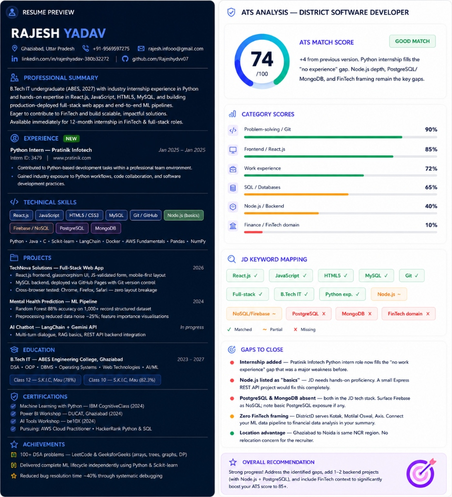
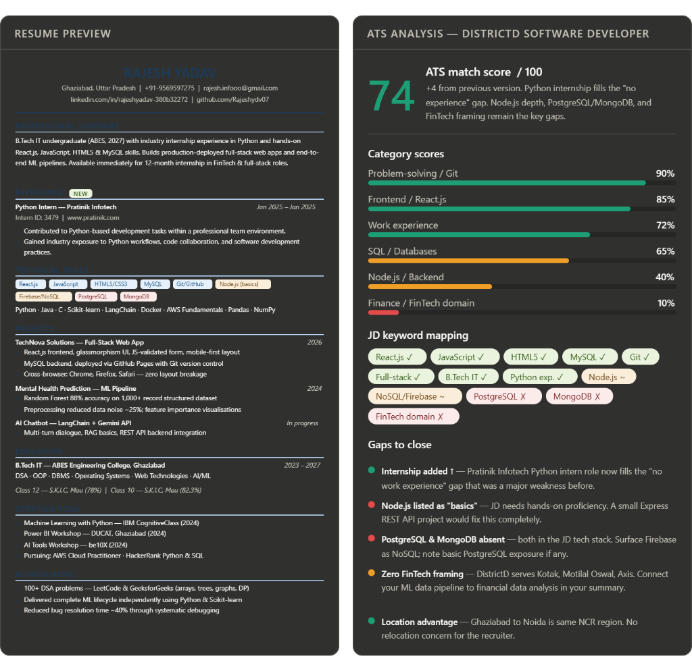

# Day 11 - ATS Resume Optimizer

## ATS Analysis

- **ATS Match Score:** **74 / 100** (Marked as a **GOOD MATCH**)
- **Score Change:** **+4 points** from the previous version.
- **Target Role:** District Software Developer (at DistrictD).
- **Observations:**
  - **Internship Added:** The addition of the **Python Internship** at *Pratnik Infotech* (Jan 2025 - Jan 2025) successfully filled the "no experience" gap, which was previously a major weakness.
  - **Key Gaps:** While the score improved, the key gaps holding the score back from 85+ are **Node.js depth**, **PostgreSQL & MongoDB experience**, and **FinTech framing**.

### Category Scores Breakdown

| Category | Score | Status / Notes |
| :--- | :--- | :--- |
| 💻 **Problem-solving / Git** | **90%** | Excellent, strong DSA and version control base. |
| 🖥️ **Frontend / React.js** | **85%** | High match, solid React.js exposure. |
| 💼 **Work Experience** | **72%** | Improved, internship fills the "no experience" gap. |
| 🗄️ **SQL / Databases** | **65%** | Moderate, need to expand from MySQL to PostgreSQL/NoSQL. |
| ⚙️ **Node.js / Backend** | **40%** | Low, Node.js is currently listed only as "basics". |
| 🏦 **Finance / FinTech Domain** | **10%** | Very low, lack of domain-specific framing. |

---

## Gap Analysis

### ❌ Missing Keywords & Skills
- **PostgreSQL:** Absent from the resume, but explicitly requested in the target Job Description (JD) tech stack.
- **MongoDB:** Absent from the resume, but explicitly requested in the JD tech stack.
- **FinTech Domain Context:** Extremely low match (10%). Rajesh has zero framing related to the financial domain. Since the target company (DistrictD) serves clients like Kotak, Motilal Oswal, and Axis, the resume needs project descriptions or summaries that tie technical work to financial data analysis.

### ⚠️ Partial Matches
- **Node.js (40% match):** Currently listed as "basics" on the resume. The JD requires hands-on, proficient backend development capabilities.
- **NoSQL / Firebase:** Partially matched. Need to surface Firebase explicitly as NoSQL database experience, and add other NoSQL systems if relevant.

### ✅ Strengths & Advantages
- **Location Advantage:** Rajesh is based in Ghaziabad, Uttar Pradesh, and the target job is in Noida. Since both are in the National Capital Region (NCR), there are no relocation concerns for the recruiter.
- **Industry Exposure:** The Python Intern role at Pratnik Infotech resolves the previous red flag of having zero industry experience.

---

## Optimized Resume

### Summary of Improvements & Action Plan
To boost the ATS score from **74/100 to 85+**, the following improvements will be implemented:

1. **Demonstrate Node.js & Backend Depth:**
   - Instead of listing Node.js as "basics," build and list a small-scale Express.js REST API project.
   - Show hands-on backend proficiency by describing API design, routing, and database integration.

2. **Add PostgreSQL & MongoDB to Database Stack:**
   - Integrate PostgreSQL or MongoDB database layers into upcoming backend projects.
   - Highlight these databases under the "TECHNICAL SKILLS" section.
   - Explicitly frame Firebase as a "NoSQL/Firebase" skill to cover NoSQL keyword filters.

3. **Incorporate FinTech Domain Framing:**
   - Align existing ML data pipelines or chatbot projects with financial data analysis context.
   - E.g., rephrase the ML Pipeline description to highlight handling of financial datasets (like stock market indices, asset prices, or transactional data).
   - This directly matches the requirements of DistrictD's product suite (which serves Kotak, Motilal Oswal, Axis).

---

## Screenshots

Below are the screenshots of the ATS optimizer feedback and score analysis (both light and dark theme versions):

### Light Theme Analysis

### Dark Theme Analysis

---

## Learnings

- **Learned ATS optimization:** Understood the impact of category scores and matching keyword frequencies for technical roles.
- **Learned keyword matching:** Recognized how critical it is to surface specific technologies (like PostgreSQL and MongoDB) rather than listing general database skills.
- **Learned JD analysis:** Analyzed how specific job descriptions map to candidates' profiles (e.g., location compatibility, category weights).
- **Learned resume customization:** Discovered how to align projects with the target company's business domain (e.g., adding FinTech framing for DistrictD).
