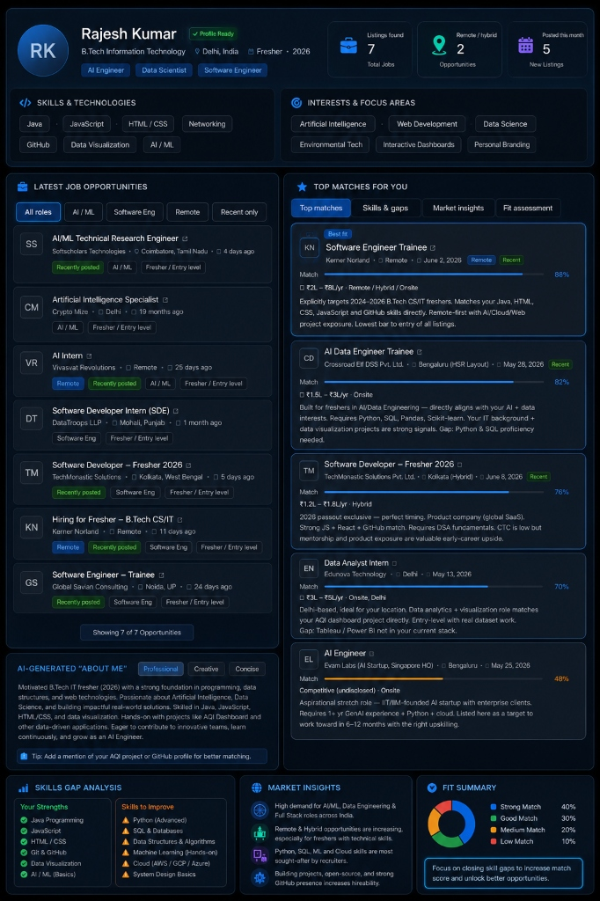

# Day 13 - AI Job Matching & Opportunity Analysis

## Objective

To analyze personalized job matching recommendations, evaluate current market demand for a B.Tech IT fresher, perform a comprehensive skills gap analysis, and outline a targeted action plan to maximize employability.

---

## Job Matching Dashboard Analysis

Below is the personalized career and opportunity dashboard analysis generated for my profile (**Rajesh Kumar**, B.Tech IT Fresher, 2026, Delhi, India):

### Overview Metrics
* **Total Job Listings Found:** 7
* **Remote / Hybrid Opportunities:** 2
* **New Listings Posted This Month:** 5
* **Profile Status:** Profile Ready (Aligned for AI Engineer, Data Scientist, and Software Engineer paths).

---

## Discovered Opportunities

The AI engine analyzed 7 active job opportunities and identified key matches, categorized by their alignment with my profile:

### 1. Software Engineer Trainee — Kerner Norland (Best Fit)
* **Match Score:** **88%**
* **Location & Mode:** Remote | June 2, 2026
* **Compensation:** ₹2L - ₹8L/yr
* **Discovered Alignment:** Specifically targets 2024–2026 B.Tech CS/IT freshers. It directly matches my core skills: Java, HTML, CSS, JavaScript, and GitHub.
* **Why it's a fit:** It is a remote-first role offering direct exposure to AI, Cloud, and Web projects, representing the lowest barrier to entry among all listed opportunities.

### 2. AI Data Engineer Trainee — Crossroad Elf DSS Pvt. Ltd.
* **Match Score:** **82%**
* **Location & Mode:** Onsite (Bengaluru - HSR Layout) | May 28, 2026
* **Compensation:** ₹1.5L - ₹3L/yr
* **Discovered Alignment:** Purpose-built for freshers in AI/Data Engineering. Aligns directly with my AI and data visualization interests. My IT background and AQI/Data Visualization projects serve as strong positive signals.
* **Gap Identified:** Requires proficiency in Python, SQL, Pandas, and Scikit-learn.

### 3. Software Developer - Fresher 2026 — TechMonastic Solutions Pvt. Ltd.
* **Match Score:** **76%**
* **Location & Mode:** Hybrid (Kolkata) | June 8, 2026
* **Compensation:** ₹1.2L - ₹1.6L/yr
* **Discovered Alignment:** Exclusive to 2026 passouts (perfect timing match). Product-based global SaaS company with strong JS, React, and GitHub alignment.
* **Gap Identified:** Requires strong Data Structures & Algorithms (DSA) fundamentals. While compensation is on the lower side, the mentorship and product exposure offer high early-career upside.

### 4. Data Analyst Intern — Edunova Technology
* **Match Score:** **70%**
* **Location & Mode:** Onsite (Delhi) | May 13, 2026
* **Compensation:** ₹3L - ₹5L/yr
* **Discovered Alignment:** Ideal geographic location (Delhi-based). The data analytics and visualization focus matches my AQI dashboard project directly. Offers entry-level experience with real-world datasets.
* **Gap Identified:** Tableau / Power BI are missing from my current technology stack.

### 5. AI Engineer — Evam Labs (Aspirational Stretch)
* **Match Score:** **48%**
* **Location & Mode:** Onsite (Bengaluru) | May 25, 2026
* **Compensation:** Competitive (Undisclosed)
* **Discovered Alignment:** Listed as a long-term target role (6–12 months target) to work toward through structured upskilling.
* **Gap Identified:** Requires 1+ years of Generative AI experience, advanced Python, and cloud platform knowledge.

---

## Skills Gap Analysis

To convert good matches (70-80%) into strong matches (90%+), I must target specific areas of improvement:

| Category | My Current Strengths | Skills to Improve / Learn |
| :--- | :--- | :--- |
| **Programming** | Java Programming, JavaScript | Python (Advanced), Data Structures & Algorithms |
| **Web Dev** | HTML / CSS, React.js (basics) | System Design Basics |
| **Data & AI** | Data Visualization, AI / ML Basics | Advanced SQL & Databases, Hands-on Machine Learning |
| **Tools & Cloud** | Git & GitHub, VS Code | Cloud Platforms (AWS / GCP / Azure) |

### Fit Summary Distribution
* **Strong Match:** 40% of target opportunities
* **Good Match:** 30% of target opportunities
* **Medium Match:** 20% of target opportunities
* **Low Match:** 10% of target opportunities (Aspirational roles like Evam Labs)

---

## Market Insights

1. **High Local & National Demand:** There is a surge in hiring for AI/ML, Data Engineering, and Full Stack roles across the Indian tech ecosystem.
2. **Growing Remote/Hybrid Culture:** Remote and hybrid work models are increasingly accessible for freshers, expanding the job search radius beyond my immediate geographic region (NCR/Delhi).
3. **Core Recruiter Filters:** Python, SQL, Hands-on Machine Learning, and Cloud (AWS/GCP/Azure) are the highest-density keywords recruiters look for on resumes.
4. **GitHub as a Resume Multiplier:** Active open-source contributions and portfolio projects (e.g., AQI Dashboard) serve as proof of work, significantly boosting overall hireability.

---

## Key Learnings

* **Resume Keyword Relevance:** Matching score is highly sensitive to tools and frameworks (e.g., lacking SQL and advanced Python drops the AI Data Engineer match score to 82%, and lacking Tableau/Power BI drops the Data Analyst match score to 70%).
* **Strategic Aspirational Target:** Aspirational roles (like Evam Labs at 48% match) shouldn't be ignored; they should be treated as maps for upskilling over the next 6–12 months.
* **The Power of Proof of Work:** My AQI Dashboard project is a major factor that triggered matches for the Data Analyst and AI Data Engineer roles, demonstrating that real-world project portfolios outweigh theoretical knowledge.
* **Closing Gaps Incrementally:** Rather than attempting to learn everything at once, the fastest route to employment is securing a "high-match, low-bar" role (like the Kerner Norland trainee position at 88% match) while continuing to upskill for advanced roles.
