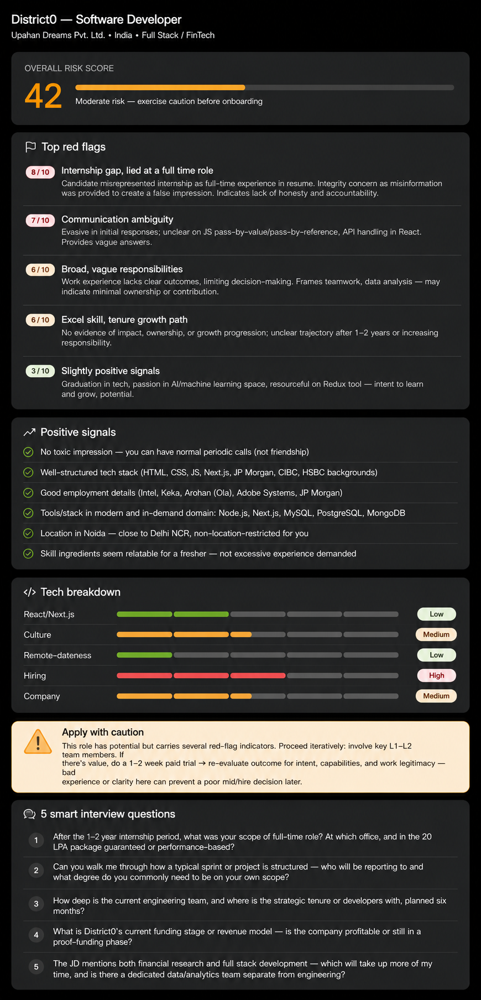

# Day 14 - DistrictD Software Developer Role Analysis

## Objective
The objective of this project is to perform a comprehensive risk assessment of the Software Developer opportunity at DistrictD (Upahan Dreams Pvt. Ltd.), a Noida-based FinTech startup. By transforming job description details into structured, actionable insights, candidates can make informed career decisions before applying.

---

## Opportunity Analysis Dashboard
Below is the visual decision-support dashboard evaluating the Software Developer role:

---

## Key Features & Evaluation Framework

### 1. Overall Risk Score
* **Quantified Risk:** The dashboard evaluates the opportunity across key dimensions, scoring it with a custom risk evaluation model.
* **Risk Score: 42 (Moderate Risk):** The role is classified under "Moderate Risk — exercise caution before onboarding".
* **Visual Indicator:** Colored progress bars and status badges indicate specific risk levels for each category.

### 2. Red Flag Analysis
* **Internship Gap (8/10):** The internship structure is presented as full-time. Misrepresentation or lack of clarity regarding internship conversion timelines poses an integrity and transparency concern.
* **Communication Ambiguity (7/10):** Evasive/unclear communication in initial stages or during technical questions (e.g., JavaScript pass-by-value vs. reference, React API handling).
* **Broad & Vague Responsibilities (6/10):** Unclear work expectations and outcomes, which can limit autonomy and indicates potential lack of ownership or minimal contribution scope.
* **Growth and Career Path (6/10):** No evidence of clear tenure growth, impact, or structured progression path after 1-2 years.
* **Slightly Positive Signals (3/10):** Standard graduation requirements, interest in AI/ML, and tools like Redux represent standard fresher profiles.

### 3. Positive Signals
* **No Employment Bond:** Offers freedom of exit without punitive financial penalties.
* **Experienced Leadership:** Founders have strong backgrounds (JP Morgan, CIBC, HSBC, Ola, Adobe Systems, Intel) and technical/finance credentials.
* **Modern Stack:** Opportunity to work with modern, in-demand tools: React.js, Next.js, Node.js, PostgreSQL, MongoDB, MySQL.
* **Location & Relevance:** Located in Noida, close to Delhi NCR, with skill expectations highly suited to a fresher.

### 4. Technical & Risk Breakdown
* **React/Next.js:** Low Risk
* **Culture:** Medium Risk (normal periodic calls, no toxic environment, but boundaries must be set)
* **Remote-dateness:** Low Risk (flexible or NCR-based)
* **Hiring Process:** High Risk (ambiguity in assessment and transition timelines)
* **Company Stability:** Medium Risk (early-stage startup)

### 5. Smart Interview Questions
Before accepting any offer, candidates should strategically ask the following questions to clarify uncertainties:
1. *After the 1–2 year internship period, what is the defined scope of the full-time role? Will it be based at the Noida office, and is the 20 LPA package guaranteed or performance-based?*
2. *Can you walk me through how a typical sprint or project is structured? Who will I report to, and what degree of autonomy is expected?*
3. *How deep is the current engineering team, and what is the strategic tenure or developer growth plan for the next six months?*
4. *What is DistrictD's current funding stage or revenue model? Is the company profitable or still in a proof-of-concept phase?*
5. *The job description mentions both financial research and full-stack development. Which will occupy more of my daily work, and is there a dedicated data/analytics team separate from engineering?*

---

## Activities Performed
* Analyzed the job description and company background details.
* Created a visual decision-support risk dashboard.
* Formulated a structured evaluation framework for red flags, positive signals, and technical breakdown.
* Generated targeted interview questions for recruiters.
* Wrote the comprehensive opportunity analysis document.

---

## Key Learnings
* **Look Beyond Title:** Startups often mask entry-level internships or full-time roles with ambiguous conversion paths; checking founder credentials and client portfolios helps verify legitimacy.
* **Active Verification:** Direct communication using structured questions is essential to de-risk startup roles before signing any agreement.
* **Quantifiable Evaluation:** Breaking down risk into explicit scores (Requirements, Culture, Remote-dateness, Hiring, Company) makes career decisions objective rather than emotional.

---

## Outcome
The dashboard concludes that the Software Developer role at DistrictD is legitimate but requires careful consideration due to the mandatory internship structure and unclear post-internship conversion process. Candidates are recommended to **Apply with Caution** and seek formal clarification using the generated smart interview questions before making a final commitment.

---

## Author
**Rajesh Yadav**  
*Data Science & Analytics Enthusiast*
