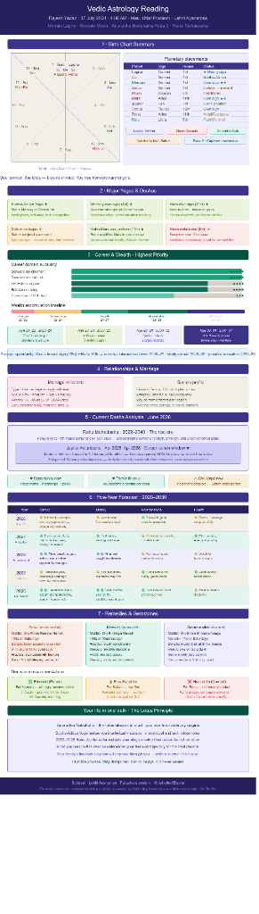

# Day 15 - Vedic Astrology Career & Life Path Analysis

## Objective
To analyze the personalized Vedic Astrology Reading for **Rajesh Yadav** (born 07 Jul 2004, 4:09 AM, Mau, Uttar Pradesh) and map the astrological planetary placements, yogas, and dasha periods to career decisions, timing milestones, and upskilling pathways.

---

## Vedic Astrology Reading Dashboard
Below is the visual dashboard summarizing my birth chart, planetary strengths, career suitability, and five-year forecast:

---

## Core Astrological Configuration

### 1. Birth Chart Summary
* **Lagna (Ascendant):** Gemini (1st House) — Strong placement. Promotes intellectual pursuit, versatility, and analytical abilities.
* **Moon Sign (Rashi):** Scorpio (6th House) — Debilitated. Points to emotional depth, resilience under pressure, and a sharp focus suitable for competitive environments.
* **Nakshatra:** Anuradha (Nakshatra Lord: Saturn, Pada 2: Capricorn Navamsa). Represents the "Lotus Principle" — growing and blooming resilience amidst challenges.
* **Key Planetary Placements:**
  * **Sun & Mercury (1st House in Gemini):** Mercury is in its own sign, forming a powerful **Budh-Aditya Yoga**. Supreme communication, tech mastery, and analytical edge.
  * **Mars (11th House in Aries):** Own sign. Strong house of gains and income, indicating significant financial growth and realization of ambitions.
  * **Rahu & Mars (11th House in Aries):** Rahu-Mars Conjunction amplifies gains, suggesting potential for unconventional tech/AI wealth.
  * **Saturn (1st House in Gemini):** Conjunct Lagna. Delays/remnant indicating early responsibilities and delayed but massive long-term rewards.
  * **Venus (12th House in Taurus):** Own sign. Governs subconscious intellect and expenditures.

---

## Major Yogas & Dashas

* **Budha-Aditya Yoga (Sun + Mercury in Gemini 1st house):** Excellent for intelligence, recognition in tech, and analytics.
* **Mercury in Own Sign (1st house):** Gives supreme cognitive strength, making software development and technical architecture natural fits.
* **Mars in Own Sign (11th house):** Guarantees that effort translates directly to financial gains and networking success.
* **Rahu-Mars Conjunction (11th house):** Drives ambition, passion for innovation, and success in cutting-edge industries (like AI/ML).
* **Saturn Conjunct Lagna:** Demands discipline and patience. Early phases of career may require high grind, but yield stable long-term fruits.
* **Moon Debilitated (6th house):** Directs emotional energy toward troubleshooting, problem-solving, and service-oriented domains.

---

## Career & Wealth Analysis

### Career Domain Suitability
* **Software Development:** ★★★★★ (Highest Fit - aligned with Gemini Lagna & Budh-Aditya Yoga)
* **Data Science / AI / ML:** ★★★★★ (Highest Fit - driven by Mercury strength and Rahu-Mars 11th house innovation)
* **FinTech / Analytics:** ★★★★☆ (Strong Fit - combining analytical capacity with financial gains houses)
* **Entrepreneurship:** ★★★★☆ (Strong Fit - supported by Aries Mars/Rahu self-starting energy)
* **Government / PSU Tech:** ★★★☆☆ (Moderate Fit - Saturn conjunct Lagna)

### Career & Wealth Timeline
* **Struggle / Prep (Age 20-22 | 2024-2026):** Foundation-building years, intense learning, and entry-level preparation.
* **First Earnings (Age 23-24 | 2027-2028):** Professional career launch, financial independence begins.
* **Growth & Stability (Age 25-27 | 2029-2031):** Rapid professional scaling and specialization.
* **Acceleration (Age 28-32 | 2032-2036):** High-impact senior roles and expansion.
* **Affluence (Age 33-40 | 2037+):** Peak wealth accumulation and leadership.

---

## Current Dasha Analysis (2025–2028)

* **Mahadasha: Rahu (2022–2040) — The Rise Era:**
  * Operating from the 11th house of gains. Encourages pursuing non-traditional tech careers, AI/ML engineering, and digital growth.
* **Antardasha: Jupiter (Apr 2025 – Apr 2028) — Career Launch Window:**
  * Jupiter is the 10th lord of career, currently transiting the 3rd house of skills and self-effort. This is the **primary window for internships, placements, and building portfolio projects**.
* **Pratyantardasha: Saturn:**
  * Tests daily discipline. Delays or initial rejections in interviews are part of the Saturnian training phase. Consistency is key.

---

## Five-Year Forecast (2026–2030)

| Year | Career Path | Wealth & Finance | Relationships & Health |
| :--- | :--- | :--- | :--- |
| **2026** (Age 21-22) | Internship attained; pursue aggressively | Low but initial earnings begin | Manage stress, prioritize sleep |
| **2027** (Age 22-23) | Strong placement; transition to full-time role | Regular salary starts; savings grow | High energy; active lifestyle |
| **2028** (Age 23-24) | Major career breakthrough / salary jump | Financial growth accelerates | Turning point; lifestyle alignment |
| **2029** (Age 24-25) | Role exploration; new technologies | Stable income; rise in standards | Good emotional clarity |
| **2030** (Age 25) | High responsibility; leadership signals | Significant wealth phase begins | Strong discipline and focus |

---

## Prescribed Remedies & Gemstones

To channel planetary energies constructively:

1. **Mercury (Strongest Planet - Intellect):**
   * *Mantra:* Recite `Om Budhaye Namah` (108 times on Wednesdays).
   * *Practice:* Keep learning structured, avoid gossip or shortcuts, maintain high integrity in documentation.
   * *Gemstone:* **Emerald [Panna]** (4-6 ratti in gold, worn on the little finger of the right hand on Wednesday mornings) — Highly Recommended.
2. **Saturn (Nakshatra Lord - Discipline):**
   * *Mantra:* Recite `Om Sham Shanaishcharaya Namah` (108 times on Saturdays).
   * *Practice:* Respect mentors, support parents/elderly, feed crows on Saturdays.
3. **Rahu (Mahadasha Lord - Focus):**
   * *Mantra:* Recite `Om Ram Rahave Namah` (108 times on Saturdays).
   * *Practice:* Engage in structured physical activity (running, gym) to anchor chaotic energy.
   * *Gemstone:* **Hessonite (Gomed) is NOT recommended**, as Rahu is already highly amplified in the 11th house.

---

## Life Philosophy: The Lotus Principle
My chart belongs to someone destined to rise significantly from ordinary origins. With **Budha-Aditya Yoga**, intellectual superiority in technical and analytical roles is a natural strength. **Anuradha Nakshatra** symbolizes the lotus — blooming beautiful and strong regardless of the surrounding mud. 

**2025–2028** is the single-most critical launchpad for my professional life. Family financial circumstances will transform through my career accomplishments. 

> "Saturn delays, but never denies. Trust the process." 🙏

---

## Activities Performed
* Digitized and structured the offline Vedic Astrology Reading details.
* Performed a detailed mapping of planetary indicators to CS/IT career choices.
* Organized a year-by-year 5-year career and financial projection.
* Integrated the astrology dashboard graphic into the repository.
