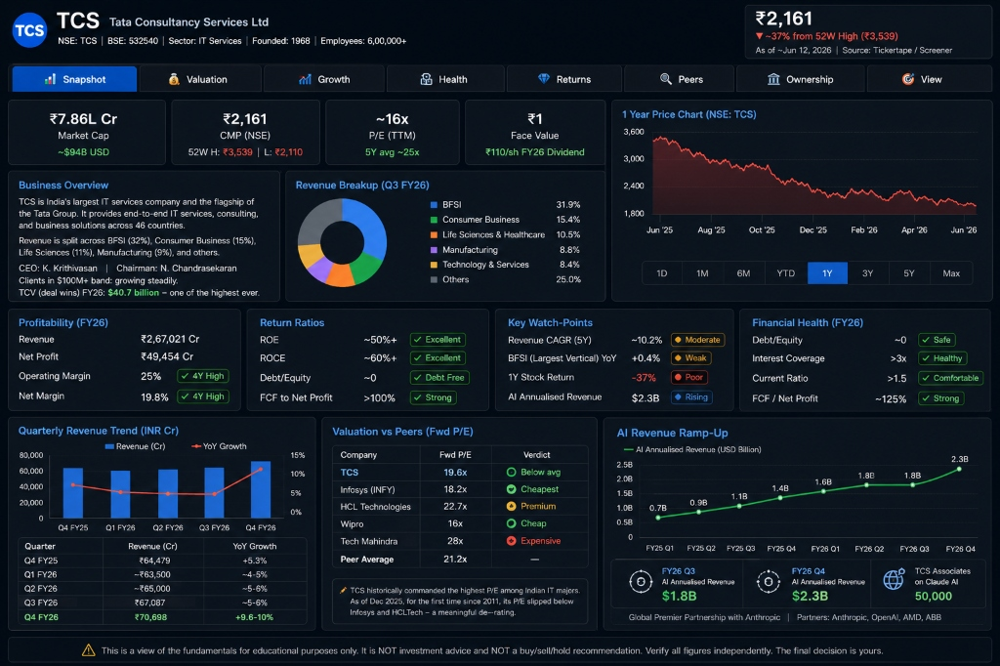
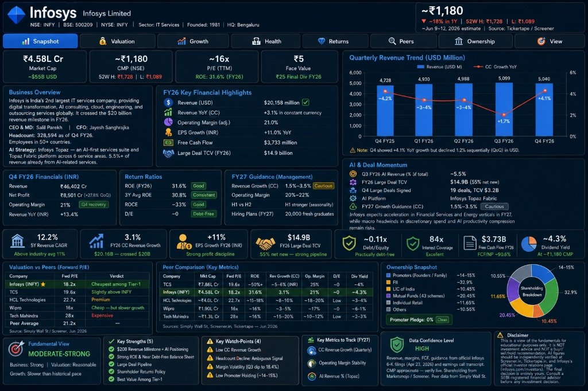
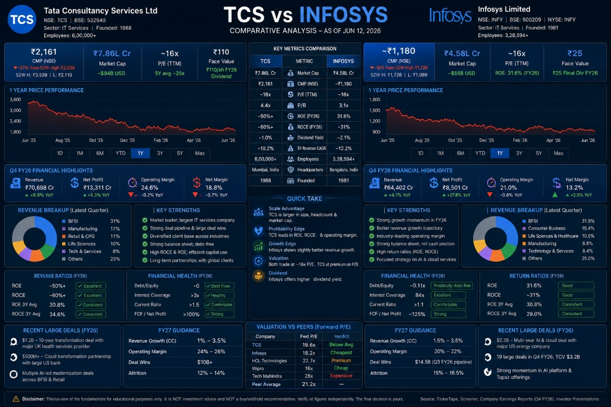
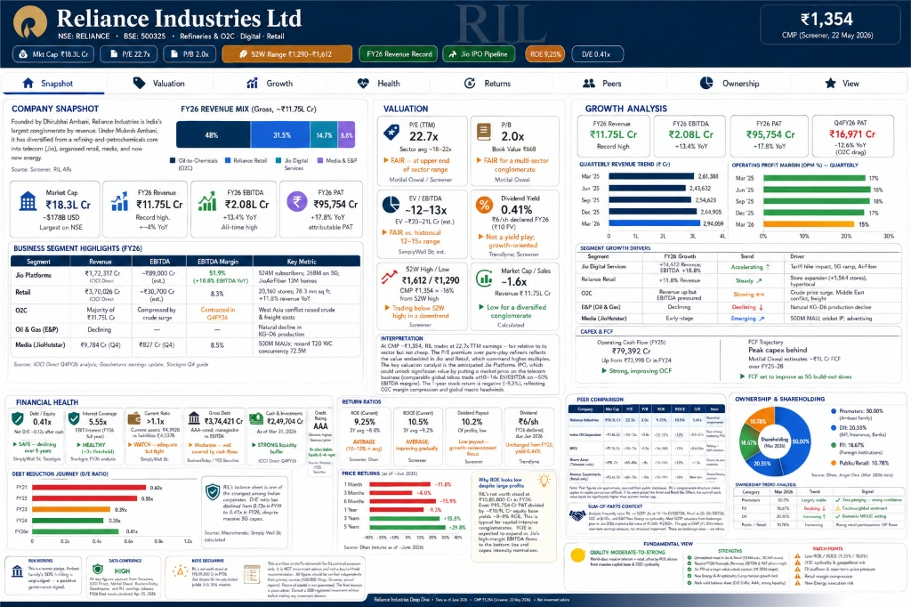

# Day 16 – Custom Skill: Stock Fundamental Research

## Objective
Create and test a reusable Claude Custom Skill for stock fundamental analysis.

## Skill Name
`stock-fundamental-research`

## Activities Completed
* **Created Custom Skill in Claude:** Configured a system prompt that structures fundamental stock research into organized, dashboard-style reports.
* **Added Stock Research Instructions:** Defined key financial parameters, valuation metrics, return ratios, and ownership analysis patterns.
* **Generated Stock Analysis Reports:** Analyzed TCS, Infosys, and Reliance Industries (RIL).
* **Compared Multiple Stocks:** Created a side-by-side comparative analysis of TCS and Infosys.
* **Reviewed Valuation Metrics:** Evaluated Forward P/E, EV/EBITDA, P/B, and compared them against peer averages.
* **Analyzed Ownership Patterns:** Tracked promoter holding, FII, DII, mutual funds, and retail investor distribution.
* **Identified Risk Factors:** Analyzed debt-to-equity ratios, growth trends, interest coverage, and key business watch-points.

## Stocks Tested
* **TCS** (Tata Consultancy Services Ltd)
* **Infosys** (Infosys Limited)
* **Reliance Industries** (RIL)

## Key Learnings
1. **Custom Skills eliminate repetitive prompting:** By configuring the skill once, we can get consistent, standardized outputs for any stock ticker.
2. **Fundamental analysis becomes standardized:** Standardized sections like Valuation, Growth, Health, Returns, and Ownership make comparing different companies straightforward.
3. **Stock comparison reports can be generated quickly:** Side-by-side tables and structured bullet points streamline peer analysis.
4. **Valuation metrics help identify attractive opportunities:** Comparing forward P/E against historical 5-year averages and peer averages highlights relative value.
5. **Risk analysis improves investment decision-making:** Tracking metrics like D/E, interest coverage, and margin trends prevents buying into highly leveraged or deteriorating businesses.

## Screenshots

### 1. TCS Snapshot Report

### 2. Infosys Deep-Dive Report

### 3. TCS vs Infosys Comparison

### 4. Reliance Industries Report

## Conclusion
The custom skill successfully generated structured stock research reports and can be reused for future stock analysis without re-entering detailed prompts.
