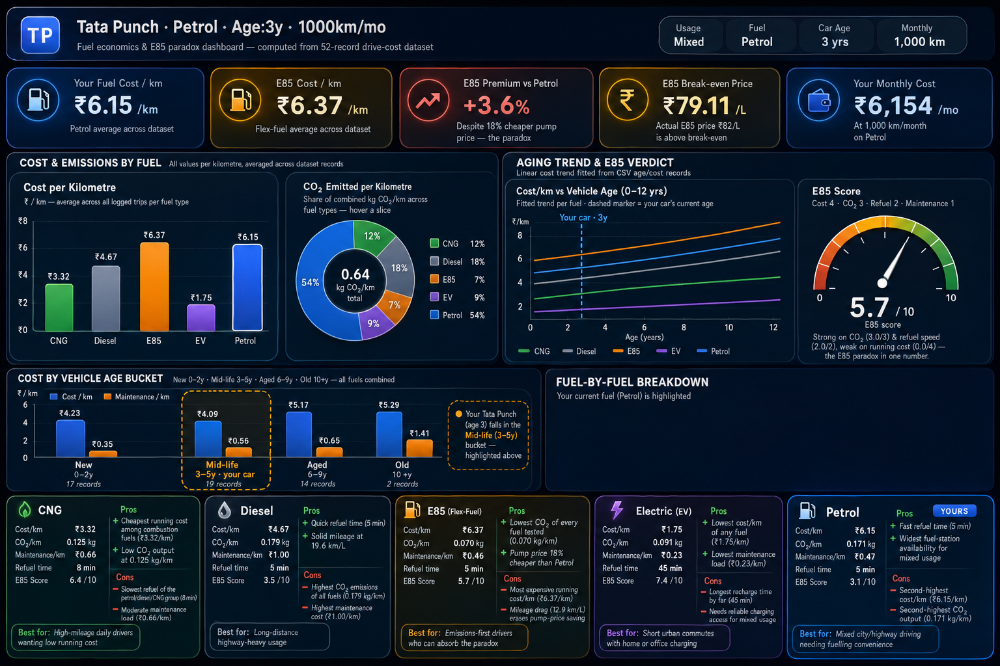

# Day 17 – Vehicle Cost Analysis Dashboard

## Overview

On Day 17, I built an interactive Vehicle Cost Analysis Dashboard using HTML, CSS, JavaScript, and SVG visualizations. The dashboard analyzes vehicle operating costs, fuel efficiency, maintenance expenses, environmental impact, and E85 fuel economics using a CSV dataset.

## Objective

* Analyze vehicle operating costs across different fuel types.
* Compare Cost/km, CO₂ emissions, maintenance costs, and refueling time.
* Evaluate E85 fuel economics and break-even calculations.
* Present insights through an interactive dashboard.

## Vehicle Details

| Parameter        | Value      |
| ---------------- | ---------- |
| Vehicle Model    | Tata Punch |
| Fuel Type        | Petrol     |
| Usage Type       | Mixed      |
| Monthly Distance | 1000 km    |
| Vehicle Age      | 3 Years    |

## Dashboard Features

* KPI Cards for key performance metrics
* Cost per KM comparison across fuel types
* CO₂ emission analysis
* Maintenance cost comparison
* Age-based vehicle cost analysis
* E85 economics and break-even calculation
* Animated SVG gauge visualization
* Responsive glassmorphism UI design

## Screenshots

### Dashboard Overview

## Key Findings

### Cost Analysis

* Fuel operating costs vary significantly across fuel types.
* Petrol provides balanced performance and accessibility.
* Alternative fuels offer potential long-term savings depending on usage patterns.

### Environmental Impact

* EV and CNG options generate lower CO₂ emissions.
* Petrol and Diesel produce higher emissions but offer strong infrastructure support.

### Maintenance Insights

* Maintenance cost increases with vehicle age.
* Mid-life vehicles generally provide the best cost-to-maintenance ratio.
* Older vehicles experience higher operational expenses.

### E85 Economics

* Lower fuel price at the pump can reduce immediate expenses.
* Reduced mileage may offset some savings.
* Break-even analysis helps determine whether E85 is financially beneficial.

### Age-Based Analysis

* New vehicles have lower maintenance costs.
* Mid-life vehicles maintain stable operating efficiency.
* Older vehicles show increasing maintenance and running costs.

## Technical Implementation

### Technologies Used

* HTML5
* CSS3
* JavaScript
* SVG Charts
* Data Analysis Techniques
* Claude AI

### Visual Components

* SVG Bar Charts
* SVG Doughnut Charts
* SVG Line Charts
* Animated Gauge Charts
* KPI Cards
* Glassmorphism Design

## Learning Outcomes

1. Learned how to transform raw CSV data into actionable insights.
2. Improved dashboard design and data visualization skills.
3. Understood vehicle operating cost calculations.
4. Explored environmental impact analysis using emissions data.
5. Analyzed E85 fuel economics and break-even concepts.
6. Practiced responsive dashboard development.
7. Enhanced data storytelling through visual analytics.

## Challenges Faced

* Processing multiple fuel categories.
* Designing responsive SVG visualizations.
* Comparing cost and environmental metrics effectively.
* Presenting complex calculations in a user-friendly format.

## Conclusion

This project demonstrated how data analytics can support vehicle ownership decisions by comparing fuel costs, maintenance expenses, and environmental impact. The dashboard provides a clear and interactive way to evaluate transportation economics and identify cost-effective fuel options.

## Repository Structure

Day17/
├── screenshot1.png
└── day17.md

## Tools & Resources

* Claude AI
* GitHub
* HTML/CSS/JavaScript
* SVG Visualizations
* Vehicle Cost Dataset

## GitHub Commit

Day 17 – Vehicle Cost Analysis Dashboard
