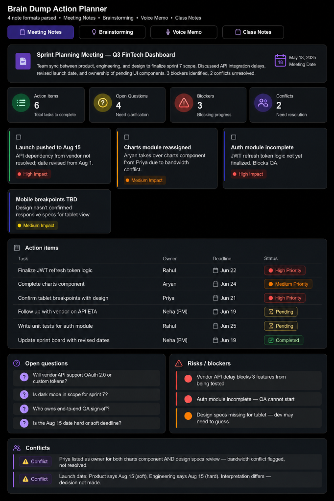
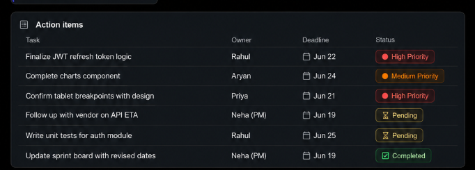
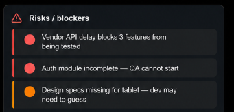

# Day 18 – Brain Dump Action Planner Skill

## Overview

Today I created a reusable Claude Custom Skill called **brain-dump-action-planner** that transforms messy notes, meeting transcripts, brainstorming sessions, voice memos, and project discussions into structured action-oriented dashboards.

## Objective

* Transform messy notes, meeting transcripts, voice memos, brainstorming sessions, and stream-of-consciousness thoughts into structured summaries, action plans, decisions, open questions, and task lists.
* Organize information clearly without inventing, assuming, or filling gaps.
* Preserve all names, dates, numbers, and terminology exactly as provided.

---

## Skill Details

* **Skill Name:** `brain-dump-action-planner`
* **Description:** Transform messy notes, meeting transcripts, voice memos, brainstorming sessions, and stream-of-consciousness thoughts into structured summaries, action plans, decisions, open questions, and task lists. Organize information clearly without inventing, assuming, or filling gaps. Preserve all names, dates, numbers, and terminology exactly as provided.

---

## What I Built

Created a Claude Custom Skill capable of:

* Summarizing large notes and transcripts
* Extracting key takeaways
* Generating action-item dashboards
* Identifying blockers and risks
* Tracking open questions
* Detecting conflicts in information
* Organizing project discussions
* Handling multiple note formats
* Producing reusable HTML dashboards

---

## Dashboard Features

The generated dashboard includes:

### Summary

Concise overview of the provided content.

### Key Takeaways

Important highlights displayed as structured cards.

### Action Items

Interactive task table with:

* Task
* Owner
* Deadline
* Status

### Open Questions

Unresolved decisions and pending clarifications.

### Risks & Blockers

Dependencies, concerns, and roadblocks.

### Conflicts

Conflicting owners, deadlines, decisions, or information.

### Additional Notes

Supporting context and extra information.

### Source Information

Available in Merge Mode when multiple notes are combined.

---

## Status Indicators

The dashboard uses visual badges:

* 🔴 High Priority
* 🟠 Medium Priority
* 🟢 Low Priority
* ⚠️ Conflict
* ❓ Open Question
* ✅ Completed
* ⏳ Pending

---

## Testing Performed

### Test 1 – Meeting Notes

* **Input:** Team meeting notes, project updates, deadlines, owner assignments.
* **Output:** Structured summary, action tracker, risk review, and open questions.

### Test 2 – Brainstorming Session

* **Input:** Random ideas, feature suggestions, product discussions.
* **Output:** Organized themes, follow-up tasks, and decision tracking.

### Test 3 – Transcript Mode

* **Input:** Speaker-based discussion transcript.
* **Output:** Speaker summary, decisions by speaker, action items by speaker, and attribution notes.

### Test 4 – Merge Mode

* **Input:** Multiple meeting notes.
* **Output:** Combined dashboard, duplicate detection, conflict review, and source tracking.

---

## Key Learnings

* **Repetitive Prompting Reduction:** Custom Skills significantly reduce repetitive prompting.
* **Improved Visibility:** Structured extraction improves task visibility.
* **Enhanced Readability:** Dashboard-based outputs make large notes easier to understand.
* **Context Preservation:** Merge Mode helps compare multiple sources without losing context.
* **Professional Artifacts:** HTML dashboards provide a professional project-management experience.

---

## Screenshots

Here are the visual representations of the custom skill configurations and dashboard outputs:

### 1. Generated Dashboard Output


### 2. Action Items Section


### 3. Risks & Blockers Section


---

## GitHub Repository Structure

```text
day18/
├── day18.md
├── index.html
├── dashboard-output.png
├── action-items.png
└── blockers.png
```

---

## Outcome

Successfully created and tested the reusable Claude Custom Skill **brain-dump-action-planner**, capable of converting unstructured notes into organized, actionable project dashboards with summaries, tasks, blockers, risks, decisions, and open questions.

---

## Tools & Resources

* **Claude AI** (Projects and Custom Skills feature)
* **HTML5 & CSS3** (for the generated interactive dashboard layout)
* **Markdown**
