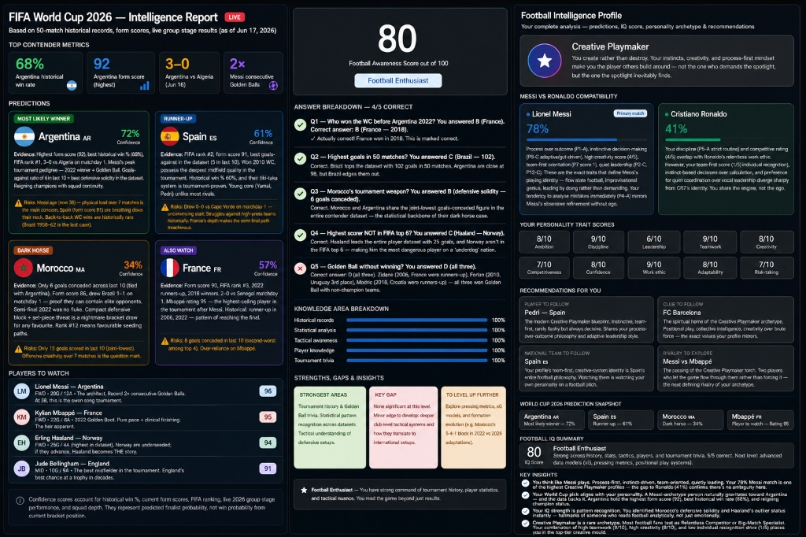

# ⚽ Football Intelligence Profile

## 📊 Executive Summary

This Football Intelligence Profile combines tournament prediction analysis, football knowledge assessment, and personality profiling to provide a comprehensive overview of football awareness, analytical thinking, and playing style preferences.

---

# 🏆 FIFA World Cup 2026 Prediction Report

## Most Likely Winner

### Argentina 🇦🇷

**Confidence:** 72%

**Key Factors**

* Highest form score (92)
* Best historical win rate (68%)
* FIFA Rank #1
* Strong squad continuity
* Defending World Champions

**Potential Risks**

* Aging core players
* Physical demands of a long tournament
* Difficulty of winning consecutive World Cups

---

## Runner-Up

### Spain 🇪🇸

**Confidence:** 61%

**Key Factors**

* FIFA Rank #2
* Exceptional midfield depth
* Strong defensive record
* Young talents such as Yamal and Pedri

**Potential Risks**

* Inconsistent finishing
* Vulnerability against aggressive pressing systems

---

## Dark Horse

### Morocco 🇲🇦

**Confidence:** 34%

**Key Factors**

* Elite defensive structure
* Excellent tournament discipline
* Proven ability against top-ranked teams

**Potential Risks**

* Limited attacking output
* Dependence on defensive stability

---

## Players to Watch

| Player          | Nation    | Rating |
| --------------- | --------- | ------ |
| Lionel Messi    | Argentina | 96     |
| Kylian Mbappé   | France    | 95     |
| Erling Haaland  | Norway    | 94     |
| Jude Bellingham | England   | 91     |

---

# 🧠 Football Awareness Assessment

## Overall Score

### 80 / 100

**Classification:** Football Enthusiast

---

## Knowledge Breakdown

| Area                 | Score |
| -------------------- | ----- |
| Historical Records   | 100%  |
| Statistical Analysis | 100%  |
| Tactical Awareness   | 100%  |
| Player Knowledge     | 100%  |
| Tournament Trivia    | 100%  |

---

## Strengths

✅ Strong understanding of World Cup history

✅ Excellent statistical interpretation skills

✅ Tactical awareness of defensive systems

✅ Advanced player and tournament knowledge

---

## Development Areas

To reach **Football Expert** level:

* Study Expected Goals (xG) models
* Learn advanced pressing structures
* Analyze positional play systems
* Explore modern tactical evolution

---

# 🌟 Football Personality Analysis

## Primary Archetype

### Creative Playmaker

You create opportunities rather than forcing outcomes. Your approach emphasizes intelligence, creativity, teamwork, and adaptability. You naturally influence games through vision, decision-making, and collective success.

---

## Messi vs Ronaldo Compatibility

### Lionel Messi

**Compatibility Score:** 78%

**Traits Matched**

* Creative problem solving
* Team-first mentality
* Adaptive decision-making
* Quiet leadership
* Process-oriented mindset

---

### Cristiano Ronaldo

**Compatibility Score:** 41%

**Traits Matched**

* Strong discipline
* Competitive mentality
* High work ethic

**Differences**

* Less focused on individual recognition
* More collaborative than dominant
* Greater preference for creativity over direct efficiency

---

## Personality Trait Scores

| Trait           | Score |
| --------------- | ----- |
| Ambition        | 8/10  |
| Discipline      | 9/10  |
| Leadership      | 6/10  |
| Teamwork        | 9/10  |
| Creativity      | 8/10  |
| Competitiveness | 7/10  |
| Confidence      | 8/10  |
| Work Ethic      | 9/10  |
| Adaptability    | 8/10  |
| Risk-Taking     | 7/10  |

---

# 🎯 Personalized Recommendations

## Player to Follow

### Pedri 🇪🇸

A modern creative playmaker who combines intelligence, vision, teamwork, and technical excellence.

---

## Club to Follow

### FC Barcelona

Known for positional football, creativity, collective intelligence, and player development.

---

## National Team to Follow

### Spain 🇪🇸

A football philosophy built around control, creativity, and teamwork.

---

## Rivalry to Explore

### Messi vs Mbappé

A fascinating comparison between creativity, influence, and modern football leadership.

---

# 🔑 Key Insights

* Strong football knowledge across history, tactics, statistics, and player analysis.
* Natural tendency toward creative and intelligent football solutions.
* High teamwork and discipline scores indicate leadership through actions rather than authority.
* Analytical thinking style aligns closely with elite playmaker profiles.
* Continued study of advanced analytics and tactical systems can elevate knowledge to expert level.

---

## Final Verdict

**Football Awareness Score:** 80/100
**Fan Classification:** Football Enthusiast
**Primary Archetype:** Creative Playmaker
**Messi Compatibility:** 78%
**Ronaldo Compatibility:** 41%

> A thoughtful, analytical football mind that values creativity, teamwork, and intelligent decision-making over individual recognition.
