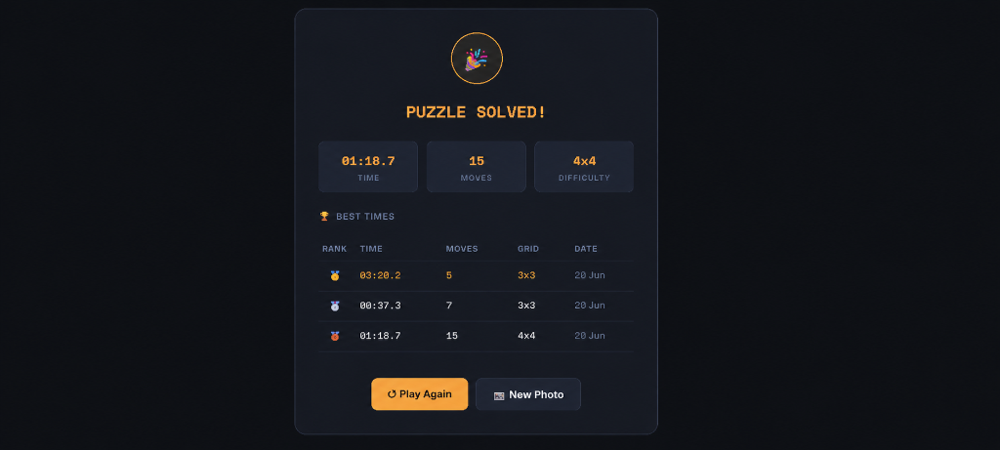

# Day 20 – Face Puzzle

## 📊 Overview

On Day 20, I built **Face Puzzle**, an interactive web-based puzzle game that uses the camera to capture a user's face, dynamically breaks it into puzzle pieces, scrambles them, and challenges the user to assemble them back. It features full touch and drag-and-drop gameplay, performance timers, move counters, and a persistence-based local leaderboard.



---

## 🎯 Key Features

* **Real-time Camera Capture**: Direct access to the front camera with a live guide overlay to help users align their faces.
* **Dynamic Grid Selection**: Three grid difficulties:
  * **3 × 3** (9 pieces) - Easy
  * **4 × 4** (16 pieces) - Medium
  * **5 × 5** (25 pieces) - Hard
* **Interactive Drag-and-Drop / Touch Gameplay**: Smooth piece-reordering logic using Canvas slicing, with a custom translucent drag ghost, drop target indicators, and success glows.
* **HUD Performance Metrics**: Live timer (sub-second resolution), move counter, and matching pieces checklist.
* **Local Leaderboard**: Stores and ranks the top 5 fastest times with grids and dates in browser `localStorage`.
* **Futuristic Dark Theme**: Premium styling utilizing deep slate hues, amber accents, and glowing micro-animations.

---

## 🛠️ Technical Implementation

### Technologies Used
* **HTML5 Canvas API**: Used to programmatically slice the captured webcam image and redraw individual grid cell elements.
* **WebRTC getUserMedia API**: Leveraged to request access to the user's front-facing camera in real-time.
* **Vanilla CSS (Grid/Flexbox)**: Fully responsive layouts with glassmorphic elements, smooth animations, and active state transitions.
* **Modern JavaScript (ES6+)**: Custom game state management, drag-and-drop event handlers (supporting mouse and touch inputs), and sub-second interval loops.

### Gameplay Logic
1. **Camera Feed & Capture**: Once user allows permissions, the stream is mapped to a video element. A canvas captures the video pixels, mirrors them for a natural view, and crops a square region.
2. **Slicing the Image**: Based on selected difficulty $N$, the cropped image is partitioned into $N \times N$ segments.
3. **Scrambling & Validation**: The indices are scrambled using a random shuffle. The game ensures the starting state is not already solved.
4. **Drag & Touch Tracking**: Absolute-positioned element mirroring the current puzzle cell is drawn underneath the user's pointer/finger during drag-and-drop actions.
5. **Score Handling**: Upon successful layout matching, elapsed time in milliseconds and move counts are stored as a JSON string inside `localStorage`.

---

## 🏆 Learning Outcomes

1. **Camera Integration**: Experienced requesting permission and processing camera feed streams inside Canvas components.
2. **Canvas Slicing**: Mastered drawing subsets of images using the `drawImage(image, sx, sy, sWidth, sHeight, dx, dy, dWidth, dHeight)` method.
3. **Multi-device Input**: Developed unified drag handlers handling both mouse and mobile touch listeners (`mousedown`, `mousemove`, `mouseup` vs. `touchstart`, `touchmove`, `touchend`).
4. **Interactive HUDs**: Built dynamic progress indicators and visual feedback (success border glows) that update on state modifications.
5. **Leaderboard Tracking**: Implemented sorting and clipping logic to preserve the top 5 records offline.

---

## 📁 Repository Structure

```text
day20/
├── face_puzzle.html
├── screenshot.png
└── day20.md
```

## 🛠️ Tools & Resources

* **HTML5 / CSS3 / JavaScript**
* **Canvases & WebRTC Media Devices API**
* **Local Storage API**
* **Claude AI**
