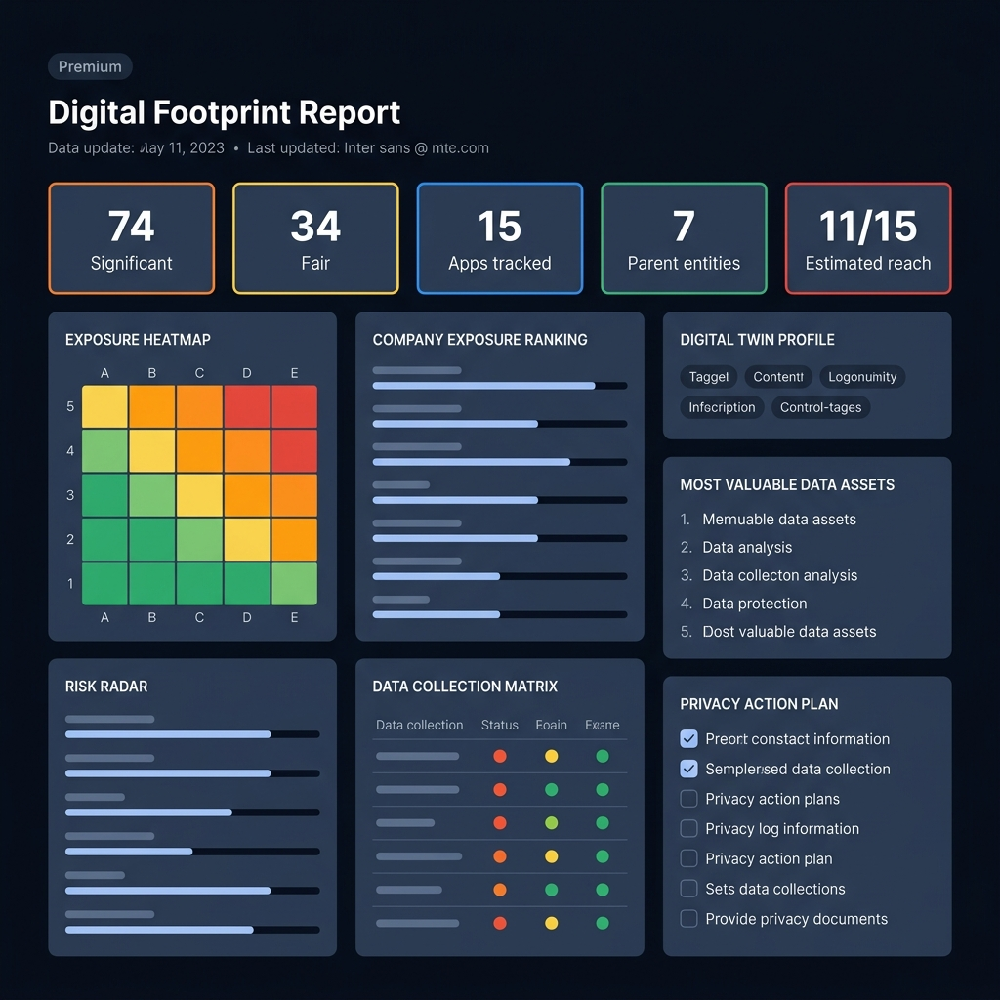

# Day 21 – Digital Footprint Privacy Dashboard

## 📊 Overview

On Day 21, I built the **Digital Footprint Privacy Dashboard**, a premium dark-themed web interface that analyzes a user's digital exposure across 15 popular services and 7 parent conglomerates. This dashboard visualizes tracking surfaces, data collection categories, corporate concentration, risk dimensions, and includes an interactive simulator for upgrading privacy settings in real-time.



---

## 🎯 Key Features

* **Three-Column Desktop Grid**: An organized layout optimized for larger screens:
  * **Left Column**: Data Exposure Heatmap (categorized by risk levels) and threat dimensions via the Risk Radar.
  * **Center Column**: Corporate Exposure Ranking (representing Alphabet, Meta, ByteDance, etc.) and the detailed Data Collection Matrix.
  * **Right Column**: Probabilistic Digital Twin Profile, valuable data assets list, and the interactive Privacy Action Plan.
* **Premium Dark Palette**: Curated dark design utilizing deep midnight hues (`#090d16`), dark slate cards (`#111622`), crisp typography (Inter), and glowing color-coded borders.
* **Interactive Score Simulator**: Real-time score calculations. Users can toggle checklist actions (like enabling 2FA or deleting face groupings) to animate the progress bar and dynamically update their overall privacy rating.
* **Tabler Icons Integration**: Clean, modern iconography aligned to the respective sections.
* **Responsive Breakpoints**: Graceful fallbacks scaling to single-column card layouts on mobile and tablet interfaces.

---

## 🛠️ Technical Implementation

### Technologies Used
* **HTML5**: Structured semantic markup utilizing HTML5 components (header, section grids, and tables).
* **Vanilla CSS**: Responsive grid layouts (`grid-template-columns`), custom properties (`:root`), flex alignment, and custom styling for checkmark overlays and active transitions.
* **Vanilla JavaScript (ES6)**: Dom query selectors, dataset attribute lookups, and state update loops calculating score deltas.
* **Tabler Icons CDN**: Loaded external icon library for professional visual design.

### Interactive Score Logic
1. **Initial State**: The user starts with a base Privacy Score of `34/100` (rated **Fair**).
2. **Checkbox Listeners**: Listening to the `change` events on all checkboxes in the action list.
3. **Delta Calculation**: Fetching the `data-points` attribute from checked elements, adding them to the base score, and capping at `100`.
4. **Dynamic Styling**: Adjusting the layout borders and progress bar width dynamically using color utility class re-assignments:
   - **Score ≤ 35**: Fair (Yellow border)
   - **Score 36–55**: Moderate (Orange border)
   - **Score 56–70**: Good (Green border)
   - **Score 71–100**: Excellent (Blue border)

---

## 🏆 Learning Outcomes

1. **Information Architecture**: Grouped complex dataset dimensions (heatmap, matrix, bars) into a highly cohesive, scannable layout.
2. **Interactive UI Simulators**: Implemented low-overhead JavaScript state tracking to simulate score adjustments without database overhead.
3. **Visual Design Principles**: Mastered high-contrast dark themes with glowing accents to draw attention to critical score values.
4. **Responsive Grid Mapping**: Designed complex nesting systems where a tabular matrix and progress trackers adapt gracefully across display sizes.

---

## 📁 Repository Structure

```text
day21/
├── digital_footprint_privacy_dashboard.html
├── screenshot.png
└── day21.md
```

## 🛠️ Tools & Resources

* **HTML5 / CSS3 / JavaScript**
* **Inter Font (Google Fonts) & Tabler Icons**
* **Claude AI**
