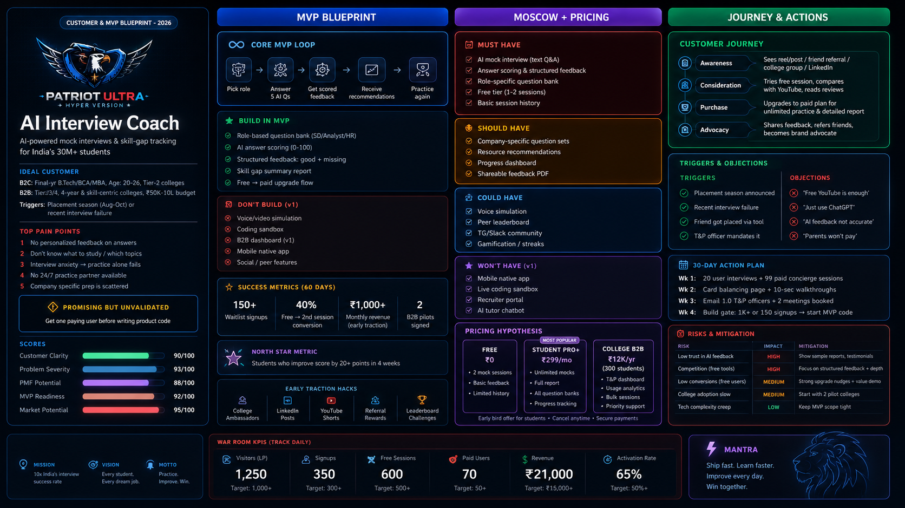

# 🚀 AI INTERVIEW COACH

### Customer & MVP Blueprint 2026

---

## 🎯 IDEAL CUSTOMER

### B2C Students

* Final Year B.Tech / BCA / MCA / MBA
* Age 20–26
* Tier 2 / Tier 3 Colleges
* Placement Focused

### B2B Colleges

* Training & Placement Officers
* Placement Analytics
* Student Readiness Tracking

---

## 🔥 TOP PAIN POINTS

1. No personalized feedback
2. Don't know what to study
3. Interview anxiety
4. No practice partner
5. Company-specific preparation gaps

---

## 🚀 MVP BLUEPRINT

### Core MVP Loop

Pick Role
↓
Answer Questions
↓
Get Feedback
↓
Receive Recommendations
↓
Improve Skills

---

### Build in MVP

✅ AI Mock Interviews

✅ Structured Feedback

✅ Skill Gap Analysis

✅ Learning Recommendations

✅ Progress Tracking

---

### Not in V1

❌ Voice Interviews

❌ Coding Sandbox

❌ Mobile App

❌ Social Features

---

## 📊 SUCCESS METRICS

* 150+ Waitlist Users
* 40% Conversion Rate
* ₹1,000+ Revenue
* 2 B2B Pilots

---

## ⭐ NORTH STAR METRIC

Students improve interview scores by 20+ points in 4 weeks.

---

## 🏗 PRODUCT PRIORITIES

### Must Have

* Mock Interviews
* Feedback Engine
* Question Bank
* Session History

### Should Have

* Company Questions
* PDF Reports
* Dashboard

### Could Have

* Voice Simulation
* Gamification
* Community

### Won't Have

* Mobile App
* Recruiter Portal
* AI Tutor

---

## 🛣 CUSTOMER JOURNEY

Awareness → Consideration → Purchase → Advocacy

---

## 💰 PRICING

### Free

₹0

### Student Pro

₹299/month

### College Plan

₹12,000/year

---

## ⚠ RISKS

* AI Trust Issues
* Competition
* Low Conversion
* Adoption Challenges

---

## 📅 30 DAY PLAN

Week 1 → User Interviews

Week 2 → Landing Page

Week 3 → College Outreach

Week 4 → MVP Launch

---

## 🦁 MANTRA

SHIP FAST

LEARN FASTER

PRACTICE • IMPROVE • WIN
